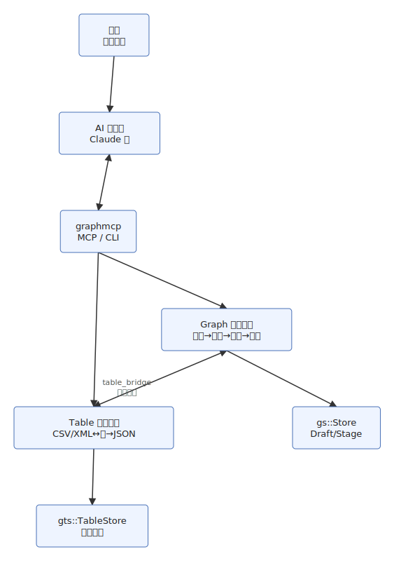
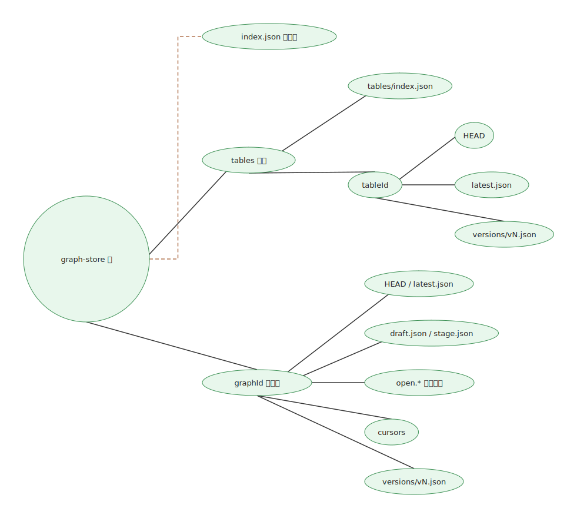
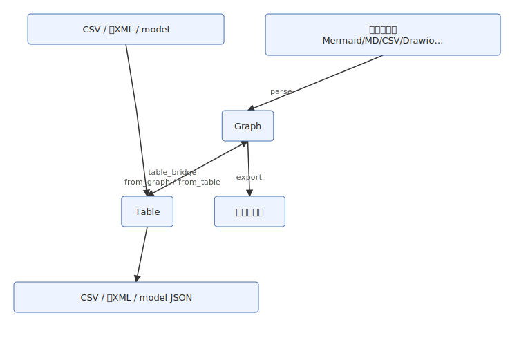
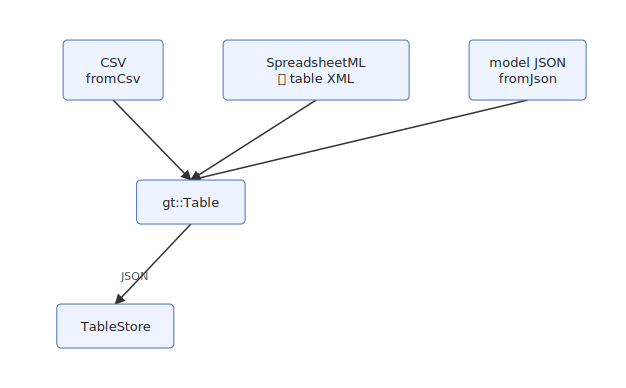
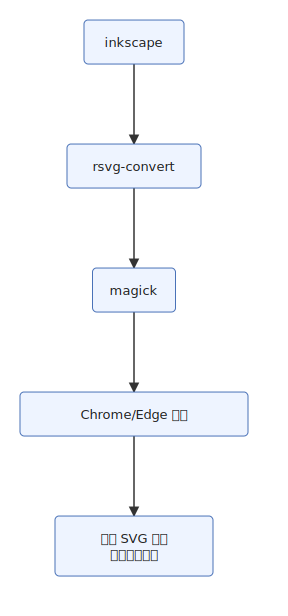
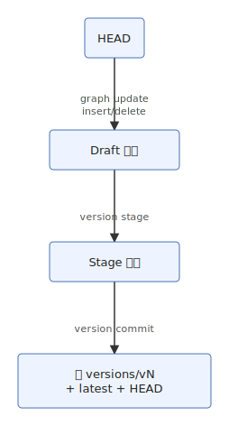

# graphmcp 应用运作逻辑详解

> latest update: v0.2.9-beta, 2026-07-17

> 应用运作逻辑说明（版本以根目录 VERSION 为准）  
> 下文已对照当前源码核对（`model.hpp` / `table_model.hpp` / `storage.hpp` / `table_storage.hpp` / `table_bridge.hpp` / `table_xml.hpp` / `csv_util.hpp` / `mcp.hpp` / `mcp_table_tools.hpp` / `main.cpp` / `version_manager.hpp` / `version_types.hpp` / `exporters.hpp` / `parsers.hpp` / `layout.hpp`）。

---

## 一、整体架构总览

graphmcp 是一个 **C++17 单可执行文件**，零第三方依赖。核心设计哲学：

> **两套并列的一等模型（Graph ↔ Table），各自完成「多格式归一 → 校验/编辑 → 持久化 → 多格式导出」；再通过有损桥接协作，而不是把表塞进图、或把业务宽表硬套成边表。**

Graph 模型支持**多图层（layers）**与**多页（pages）**，draw.io 往返保留图层/页面结构。

整体架构（由 graphmcp 导出；制图版本见 [`diagrams/doc-figures`](diagrams/doc-figures)，图 id=`arch-overview`）：



| 层次 | 组件 | 职责 |
|------|------|------|
| 用户层 | 人 | 用自然语言描述图 / 表需求 |
| AI 层 | Claude Code / Desktop 等 | 理解意图，调用 MCP 工具 |
| 协议层 | JSON-RPC 2.0 over stdio | AI 与 MCP 服务器通信 |
| 服务层 | `graphmcp serve` / CLI | 分发到 Graph 或 Table 模块 |
| 逻辑层 | 双模型 + 桥接 + 版本/游标 | Graph：`parsers`/`layout`/`exporters`/`version_manager`；Table：`table_*`；协作：`table_bridge` |
| 存储层 | 文件系统 (`GRAPHMCP_STORE`) | 图与表**目录并列**，同根不同树 |

**协作原则**：图主路径与表主路径互不替代。边表 CSV 可经 `parseCSV` **直接进 Graph**；业务宽表应进 **Table**，再按需桥接。桥接一律视为**有损投影**（见 `table_bridge.hpp` 的 `mode` / 列映射）。

---

## 二、MCP 服务器设计

### 2.1 协议实现

| 特性 | 实现方式 |
|------|---------|
| 协议 | JSON-RPC 2.0 |
| 传输 | stdio（行分隔） |
| 实现文件 | `src/mcp.hpp`（表工具实现辅助：`mcp_table_tools.hpp`） |
| 服务版本 | `SERVER_VERSION`（读取根目录 `VERSION`） |
| 启动方式 | `graphmcp serve` |
| 存储路径 | 环境变量 `GRAPHMCP_STORE`，默认 `./graph-store` |

### 2.2 MCP 协议握手流程

| 步骤 | 方向 | 消息类型 | 内容 |
|------|------|---------|------|
| 1 | AI → 服务器 | `initialize` 请求 | 客户端能力声明 |
| 2 | 服务器 → AI | `initialize` 响应 | 服务器能力 + 协议/服务版本 |
| 3 | AI → 服务器 | `initialized` 通知 | 握手完成（通知不回包） |
| 4 | AI → 服务器 | `tools/list` 请求 | 查询可用工具 |
| 5 | 服务器 → AI | `tools/list` 响应 | **51** 个工具定义 |
| 6 | AI → 服务器 | `tools/call` 请求 | 调用具体工具 |
| 7 | 服务器 → AI | `tools/call` 响应 | 结果文本；异常时 `isError: true` |

### 2.3 MCP 工具（51 个，`toolList()`）

完整参数速查见 [CLI_MCP_REFERENCE.md](CLI_MCP_REFERENCE.md)。契约以 `make docs-api`（`dump-tools`）写出的 [`openapi.yaml`](api_reference/openapi.yaml) 为准。按职责分组：

| 分组 | 工具 |
|------|------|
| 图生命周期 | `graph_create`、`graph_convert`、`graph_export`、`graph_open`、`graph_import`、`graph_validate`、`graph_list`、`graph_delete`、`graph_layout` |
| 图查看 / 属性 | `graph_show`、`graph_history`、`graph_diff`、`graph_status`、`graph_property` |
| Draft 编辑 | `graph_update`、`graph_insert`、`graph_delete_element`、`graph_apply`、`graph_set_edge_route`、`graph_clear_edge_route`、`graph_nudge_node`、`graph_set_edge_heads` |
| 图版本 | `graph_draft`、`graph_stage`、`graph_commit`、`graph_rollback`、`graph_checkout` |
| 游标 | `graph_cursor_open`、`graph_cursor_get`、`graph_cursor_move`、`graph_cursor_close` |
| 表 CRUD 与版本 | `table_create`、`table_import`、`table_export`、`table_list`、`table_show`、`table_update`、`table_delete`、`table_history`、`table_rollback`、`table_diff` |
| 图↔表桥接与协作 | `table_from_graph`、`graph_from_table`、`table_align`、`table_check`、`table_rules_from_graph`、`table_fix_enums`、`table_derive`、`table_transform_column`、`table_sample_rows`、`table_propose_rows` |

注意：`graph_rollback` 走 `Store::rollback`——把旧快照**再 save 成新版本**（版本号递增），与 `graph_checkout`（只改 `HEAD`）不同，见 §十。表侧仅有 `table_rollback`（同样是 load 旧版再 save），**没有** Table 的 Draft/Stage/checkout。

---

## 三、存储层（数据库）设计

graphmcp 不使用传统数据库，而是**基于文件系统的 JSON 存储**。图与表共享 `GRAPHMCP_STORE` 根，**目录并列、索引分离**。

### 3.1 目录结构

目录结构（图 id=`store-layout`）：



### 3.2 图文件职责

| 文件 | 格式 | 读写特征 | 说明 |
|------|------|---------|------|
| `index.json` | JSON | 频繁读写 | 每图 id、name、type、versions、时间戳 |
| `HEAD` | 纯文本 | 读写 | 单行版本号；`save` / `commit` / `checkout` 会更新 |
| `latest.json` | JSON | 读写 | **仅**在 `Store::save` 时重写；`checkout` **不**改写它 |
| `draft.json` / `stage.json` | JSON | 读写 | Draft / Stage 工作流（**仅图**） |
| `versions/vN.json` | JSON | 只追加 | 不可变快照 |

表侧同样有 `HEAD` / `latest.json` / `versions/`，语义与图的 `save`/`rollback` 类似，但**无** draft/stage。

### 3.3 存储操作对照

| 操作 | CLI / MCP | 存储层行为 |
|------|-----------|-----------|
| 创建图 | `create` / `graph_create` | 写图索引、子目录、`latest`、`v1`、`HEAD` |
| 修改图元素 | `graph update/insert/delete` | 写 `draft.json`，不直接改 `latest` |
| 图暂存 / 提交 | `version stage/commit` | stage → `Store::save` → 新快照 + 更新 `latest`/`HEAD` |
| 图 checkout | `version checkout` | 只写 `HEAD`；清空 draft/stage；不改 `latest` |
| 图 rollback | `rollback` / `graph_rollback` | load 旧版再 `save` → **新**版本号 |
| 创建/导入表 | `table create|import` / `table_*` | `TableStore::save` → 表索引 + `latest` + `versions` |
| 改表 | `table update` | 读表 → 改内存 → `save`（直接出新版本；无 Draft） |
| 表 rollback | `table rollback` | load 指定版本再 `save` → 新版本号 |
| 导出图/表 | `export` / `table export` | 读对应 `latest` 或指定版本 |

---

## 四、双管道导入导出 + 桥接

### 4.1 设计原则

> 不是「一切都进 Graph」。Graph 与 Table 各有 **N→模型→M** 管道；跨模型只用桥接，复杂度为 **(Nᵍ+Mᵍ) + (Nᵗ+Mᵗ) + Bridge**，而不是把业务表硬折进图模型。

双管道与桥接（图 id=`dual-pipeline`）：



### 4.2 图输入 → 解析器

| 输入格式 | 解析函数 | 关键解析能力 |
|---------|---------|-------------|
| **Mermaid** | `parseMermaid()` → 19 种子类型 | 深解析：`flowchart`、`mindmap`、`erDiagram`、`classDiagram`、`stateDiagram`、`sequenceDiagram`、`requirementDiagram`、`gantt`、`pie`、`sankey`、`kanban`、`gitGraph`、`journey`、`timeline`、`quadrantChart`、`xychart`、`block`、`packet`、`architecture`；扩展数据进 `Graph.properties`；不支持的类型可走 `rawMermaid` 透传 |
| **Markdown** | `parseMarkdownOutline()` | 标题/列表层级 → mindmap 树 |
| **CSV** | `parseCSV()` | **边表 / 层级表** → Graph（与业务宽表进 Table 不同路径） |
| **XML** | `parseXML()` | 迷你 XML，根须为 `<graph>` |
| **Excalidraw** | `parseExcalidraw()` | elements → 逻辑节点/边，并保留原始元素与 `files` 附件 |
| **Drawio** | `parseDrawio()` | mxCell → Graph（含图层 layers） |
| **统一模型** | `parseModel()` / `detectFormat` | Graph JSON；`auto` 自动探测格式 |

### 4.3 图输出 → 导出器

| 输出格式 | 关键能力 |
|---------|---------|
| **Drawio** | 子节点相对坐标、mxCell、颜色字段；**多图层（layers）与多页（pages）往返** |
| **Mermaid** | 形状转义、subgraph；flowchart 可写 `classDef`/`linkStyle` 等颜色指令 |
| **Excalidraw** | 原始 elements 优先（无损往返）、变换、freedraw |
| **SVG** | 边裁剪到节点边界等；Excalidraw 精确路径 + 离线字体内嵌 |
| **PNG / PDF** | 先 SVG，再走外部转换器链（§4.5）；也支持 Mermaid 直接经 headless 浏览器渲染 |
| **URL** | Mermaid Base64 → mermaid.live 编辑链接 |
| **Browser Page** | `toMermaidBrowserPage()`：内嵌 Mermaid.js 的完整 HTML 页面 |
| **model** | Graph JSON（含 layers / pages / properties） |

### 4.4 表输入 / 输出

表输入 / 输出（图 id=`table-io`）：



| 方向 | 实现 | 说明 |
|------|------|------|
| 入 | `Table::fromCsv` / `table_xml` / `fromJson` | CLI/MCP 用 `format`（默认 `csv`）选择；`format=xml` 在 SpreadsheetML 与旧 `<table>` 间自动识别，**不做** csv/xml/model 跨格式探测 |
| 出 | `toCsv` / SpreadsheetML（`to=xml`）/ 旧方言（`to=table-xml`）/ `toJson` | `table_export` 的 `to=csv|model|xml|table-xml` |

实现约束（避免误用）：

- `table_create` 不覆盖已存在 id（除非 `force=true`）；`table_import` 用于 upsert。
- `table_update.set_cells` 仅接受 `column` 或 `col_index`。
- `table_from_graph` 返回可含截断 preview；全量表导出用 `table_export`。
- skeleton：优先「子节点全为叶子」的父节点作列、子节点文案作 hint；说明行经 `hasHintRow` 标记，`table_check` 可 `ignore_hint_row`。
- **不是**边表转图的 `parseCSV`，也**不是**图 XML（根 `<graph>`）。仓库内权威为 Table JSON。

#### 表 XML 与后续抽离约定

默认表 XML 为 **SpreadsheetML 2003** 子集（零第三方依赖手写编解码）；旧命名字段行方言仅兼容读入/显式 `table-xml`。逻辑在 `src/table_xml.hpp`，复用 `gp::detail::parseXmlDoc` 与现有 `Table` API，**不**改写 `Table::fromCsv`，**不**搬迁 `parsers.hpp` 中的迷你 XML 解析器，**不做**完整 `.xlsx`。

出现下列**任一**情况时，应单独开重构 PR：

1. **行为漂移**：CSV 与表 XML 在空行/`normalize`/缺列/meta 等处理上不一致（格式差异除外）。
2. **第三种表输入**：再增加一种表交换格式（或表 XML 多后端）。
3. **模块边界**：表侧需脱离 `parsers.hpp`（编译依赖、拆库、或 `detail` 变更误伤表 XML）。

届时目标：抽出 `xml_util.hpp`；抽出共用装表逻辑；映射层仍分离。

### 4.5 图↔表桥接（`table_bridge.hpp`）

| 方向 | 工具 | 行为摘要 |
|------|------|----------|
| 图 → 表 | `table_from_graph` | `mode`: `skeleton` \| `edgelist` \| `hierarchylist` \| `nodelist`（有损）；skeleton 优先用「子节点全为叶子」的父节点作列、子节点文案作枚举 hint |
| 表 → 图 | `graph_from_table` | 自动识别边表（`from`/`to`/`source`/`target` 列）或层级表（`id`/`parent`），或显式列映射 |
| 规则 | `table_rules_from_graph` | 导图结构（同 skeleton 启发式） → 校验规则表 |
| 校验/修复 | `table_check` → `table_fix_enums` | 基于规则 `AllowedSpec` 校验单元格；`fix_enums` 按 suggestion 自动修，无建议则记入 `skipped` |
| 对齐 | `table_align` | 按主键对齐两张表，补缺失行 |
| 派生 | `table_derive` | 从源表派生新表（如 `animation_checklist`） |
| 列变换 | `table_transform_column` | 列值 slug 化（去除非 ASCII，空格转下划线） |
| 占位行 | `table_sample_rows` | 根据规则/hint 行填充占位行 |
| 提案行 | `table_propose_rows` | JSON 结构体批量追加行，含枚举合法性校验 |

### 4.6 PNG/PDF 渲染回退链（仅图导出）

实现见 `exporters.hpp`：

渲染回退链（图 id=`png-fallback`）：



---

## 五、双一等模型——系统的心脏

### 5.1 Graph 数据结构（`model.hpp`）

```
Graph {
  id, name, type          // flowchart|architecture|er|orgchart|mindmap|whiteboard…
  rawMermaid              // 未深解析类型的透传原文（可选）
  properties              // 类型专用结构化 JSON（pie/sequence…；可经 graph_property 读写）
  layers[]                // Layer { id, name, visible, locked } — 多图层
  pages[]                 // Graph[] — 多页（首页为 Graph 自身）
  nodes[]                 // Node { id, label, shape, parent, layer, style,
                          //   fillColor, strokeColor, attrs[], x,y,w,h }
  edges[]                 // Edge { id, from, to, label, style,
                          //   arrow, headStart, headEnd, strokeColor,
                          //   labelX, labelY（边标签偏移定位）,
                          //   seqNum, isAsync（序列图/gitGraph） }
  elements[]              // Excalidraw 原始元素
  files                   // Excalidraw 附件（image 等）
  laidOut
}
```

颜色为空串表示使用导出默认值。Mermaid 导入可消费 `classDef`/`style`/`linkStyle`；导出 flowchart 时可再写出颜色指令。

`headStart` / `headEnd` 为细粒度箭头控制（`none`/`arrow`/`diamond`/`circle`/`cross` 等），与旧 `arrow` 字段双向兼容。`layer` 字段关联节点到 Layer。`labelX` / `labelY` 允许边标签精确偏移。

### 5.2 Table 数据结构（`table_model.hpp`）

```
Table {
  id, name
  hasHintRow              // 首行是否为说明/hint（skeleton 等生成）
  columns[]               // 列名
  rows[][]                // 矩形单元格矩阵；normalize() 补齐宽高
}
```

与 Graph **同级**：独立序列化（`toJson`/`fromJson`）、独立存档。注释与模块头均标明「与 Graph 并列的一等对象」。

### 5.3 节点类型与形状（Graph）

| type | shape 取值（典型） | 用途 |
|------|-------------------|------|
| flowchart | rect, diamond, round, ellipse, stadium, hexagon, process, parallelogram, delay, manualInput, display, trapezoid, triangle, step, note, cube, message… | 流程 |
| architecture | rect, cylinder, cloud, document, cube, … | 架构 |
| er | rect + `attrs` 行 | 实体表 |
| orgchart / mindmap | rect, round, ellipse | 组织 / 脑图 |
| whiteboard | 自由绘制相关 shape + elements | 白板 |
| uml | umlActor | 序列图/类图参与者 |

`shape` 为空时导出器按图类型自动选择默认形状。

### 5.4 层级与 ER（Graph）

`node.parent` 同时服务：流程图 subgraph、脑图/组织树、架构容器嵌套。

`parseMermaidER` 对 `A ||--o{ B : label`：左右实体建节点，边使用 `arrow="none"`，基数符号不单独建模，业务标签留在 `label`。

### 5.5 两模型如何分工

| 需求 | 走 Graph | 走 Table |
|------|----------|----------|
| 画流程图 / 白板 / Mermaid 多图种 | ✅ | — |
| 边表 CSV 快速成图 | ✅ `parseCSV` | 或 Table 后再 `graph_from_table` |
| 业务宽表、枚举校验、跨表对齐 | — | ✅ |
| 从导图抽规则并修表 | 源在 Graph | 规则与数据在 Table |

---

## 六、版本管理系统

### 6.1 图：类 Git（Draft / Stage / Commit）

图版本工作流（图 id=`version-workflow`）：



| Git 操作 | graphmcp 操作 | 说明 |
|----------|-------------|------|
| 改文件 | `graph update/insert/delete` + `graph_property` | 累积在 `draft.json`；支持节点/边 CRUD 和 `PROPERTY_SET/INSERT/DELETE` |
| `git add` | `version stage` | 暂存；支持全量暂存（`stageAll`）或按索引选择（`stageSelected`） |
| `git commit` | `version commit`（或 `commitAll` 跳过暂存） | 不可变快照；写入顺序 draft→stage→HEAD 防崩溃丢数据 |
| `git log` / `diff` / `status` | `version log` / `diff` / `status` | `diff` 为字段级对比 |
| `git checkout` | `version checkout` | **只移动 HEAD**（见 §十） |
| （无直接对应） | `rollback` / `graph_rollback` | 旧快照另存为**新**版本 |

Draft 基于操作序列（非快照）：存储 `OpType` 11 种操作（含 `META_UPDATE`、`PROPERTY_*`），`Commit::rebuild` 统一物化。Commit 同时写 patch + 完整快照，兼顾效率与可追溯。

### 6.2 表：简化版本（仅快照）

每次成功的 `table create|import|update|rollback|…` 落盘都走 `TableStore::save`：写 `latest.json`、追加 `versions/vN.json`、更新 `HEAD` 与表索引。

- **有**：`table_history` / `table_diff` / `table_rollback`
- **无**：draft / stage / commit / checkout / 游标

设计取舍：表以整表替换与批量 `update` 为主，未引入图侧那套操作日志式 Draft。

---

## 七、用户 → AI → MCP → 存储 交互与模块

### 7.1 创建并导出（示意）

**图**：`tools/call graph_create` → `parseAny` → `validate`（有 error 则 `status:"rejected"` + `isError`）→ `layout` → `Store::save` → 再 `graph_export`。

**表**：`table_create` / `table_import` → 按 `format` 解析 → `TableStore::save` → `table_export` 或桥接 `graph_from_table`。

### 7.2 模块协作

| 模块 | 文件 | 职责 |
|------|------|------|
| JSON | `json.hpp` | 递归下降解析；**对象键保持插入顺序** |
| 图解析 | `parsers.hpp` | 多格式 → Graph；`ParseError` |
| 图模型 | `model.hpp` | Graph / Node / Edge（含颜色与 `properties`） |
| 布局+校验 | `layout.hpp` | 图校验与布局（Kahn + 环兜底、tree/grid、group 包围盒；状态图允许 `[*]`）；v0.2.6：层平衡、barycenter 减交叉、waypoint 折线路由与边标签定位（尚不完善） |
| 图导出 | `exporters.hpp` | 多格式导出、栅格化、编辑器调起 |
| 图存储 | `storage.hpp` | index / latest / versions / Draft 相关文件 |
| 图版本 | `version_manager.hpp` | Draft/Stage/Commit、checkout、游标路径 |
| 游标类型 | `cursor_types.hpp` | 游标数据结构 |
| 表模型 | `table_model.hpp` | `gt::Table` |
| 表 XML | `table_xml.hpp` | 表 XML ↔ Table |
| 表存储 | `table_storage.hpp` | `gts::TableStore` |
| 图↔表桥接 | `table_bridge.hpp` | 投影、对齐、规则、fix、derive… |
| CSV 工具 | `csv_util.hpp` | 字段转义 / 分行 |
| MCP | `mcp.hpp` + `mcp_table_tools.hpp` | JSON-RPC、**51** 工具 |
| CLI | `main.cpp` | **15** 个命令族：`create`/`convert`/`export`/`edit`/`import`/`layout`/`validate`/`store`/`table`/`version`/`graph`/`cursor`/`draft`/`serve`/`dump-tools`；旧版扁平命令走 `handleLegacyCommand` |

### 7.3 关键设计决策（与代码一致）

| 决策 | 做法 | 原因 / 依据 |
|------|------|-------------|
| 双一等模型 | Graph ∥ Table，桥接有损 | 业务表与图结构语义不同 |
| 图：N→Graph→M | 统一图管道 | 避免图格式 N×M 转换器 |
| 表：独立存档 | `tables/` + Table JSON | 与边表进图路径分离 |
| 零第三方依赖 | 手写 JSON/XML/Base64 | 单文件可移植 |
| 不可变快照 | `versions/vN.json` 只追加 | 可回溯 |
| 图有 Draft、表无 | 操作粒度不同 | 图偏增量编辑；表偏整表写入 |
| Excalidraw 保真 | `elements`（及 `files`）保留 | 白板往返 |
| PNG/PDF | 外部转换器链 + SVG 回退 | 核心零依赖 |
| MCP 通知 | 不回包 | JSON-RPC 通知语义 |
| Chromium | `--user-data-dir` 隔离 | 避免附着用户浏览器 |
| JSON 保序 | `json.hpp` 保留插入顺序 | 输出稳定 |
| Windows CLI | `GetCommandLineW` + UTF-8 | 中文参数不乱码 |

---

## 八、错误处理约定（对照 `main.cpp` / `mcp.hpp`）

| 场景 | CLI | MCP |
|------|-----|-----|
| 解析等未捕获异常（含 `ParseError` / `TableError`） | `main` 的 `catch` → 退出码 **2** | `call` 捕获后 → `isError: true` |
| 读文件失败（`readInput`） | `exit(2)` | 工具侧错误文本 |
| create/import 校验有 **error**（图） | 打印 `rejected:…`，退出码 **3** | `status: "rejected"` + `isError: true` |
| PNG/PDF 无转换器 | 写出 `.svg` 回退并提示 | 同左（经 `exportGraph`） |

另有退出码 1（用法/缺参）、4/5（导出失败等），见各命令族实现。

---

## 九、已知边界

| 边界 | 代码依据 |
|------|----------|
| Mermaid 支持 19 种子类型 | `parseMermaid*` 深解析（含 sankey/kanban/gitGraph/journey/timeline/quadrantChart/xychart/block/packet/architecture）；其余可 `rawMermaid` 或报错；结构化扩展进 `properties` |
| ER 基数不建模为箭头类型 | `addEdge(..., "none")`，标签保留 |
| 布局 | Kahn + 环兜底；group 包围盒；`tree-h` / `tree-v` / `grid` / `auto`（`layered` 别名）；state 允许 `[*]`；`rawMermaid` 图标记已布局不处理；**v0.2.6** 分层另含层平衡、barycenter 减交叉、`Edge.waypoints` 折线路由与边标签定位（复杂图观感尚不完善） |
| PNG/PDF | 依赖本机转换器或浏览器（inkscape→rsvg-convert→magick→Chrome/Edge headless）；无则 SVG 回退；Mermaid 可直接经 headless 浏览器渲染 |
| 多图层/多页 | draw.io 往返保留；其他导出格式可能有损（如 Mermaid 不支持图层） |
| 图↔表桥接有损 | `table_bridge.hpp`；不保证往返幂等 |
| 表无 Draft/Stage | `table_storage.hpp` 简化版本；仅快照式版本 |
| 不做 Excel `.xlsx` 全量读写 | 以 CSV / 表 XML / JSON 为交换面 |
| `import` 命令族 | `main.cpp` 已分发；`--help` 族列表可能未列全，以代码为准 |
| 表存储 crash 安全 | `TableStore::save` 使用 `writeFileAtomic`；图侧 `Store::save` 无原子保证 |

---

## 十、旧版 CLI 与 checkout / rollback

| 机制 | 代码位置 | 行为 |
|------|----------|------|
| 旧版扁平命令 | `handleLegacyCommand`（`subcommand` 为空时） | 仍支持旧式 `create`/`convert`/`export`/`edit`/`validate`/`list`/`show`/`history`/`rollback` 等 |
| 新版命令族 | `main` 按 `family` 分发 | 含 `import`、`table` 等 |
| `Store::rollback` / `graph_rollback` | `storage.hpp` | 加载旧版本再 `save` → **新版本号**，并更新 `latest` + `HEAD` |
| `version checkout` / `graph_checkout` | `GraphVersionManager::checkout` | 有未提交 draft 且无 force 则失败；否则清空 draft/stage，**只写 HEAD**；不新建版本，不改 `latest.json` |
| `TableStore::rollback` / `table_rollback` | `table_storage.hpp` | 同图 rollback 语义（另存新版本）；**无** checkout |

因此：图侧混用「rollback 另存」与「checkout 移指针」时，`latest.json` 与 `HEAD` 可能暂时不一致——`version status` 以 `HEAD` 为准。

---

## 十一、测试入口（对照 `Makefile` / CI）

| 命令 | 说明 |
|------|------|
| `make test` | `tests/test_main.cpp`（图模型单元测试） |
| `make test-version` | `tests/test_version.cpp`（版本管理单测） |
| `make test-cursor` | `tests/test_cursor.cpp`（游标单测） |
| `make test-all` | 上述三者 |
| `make bench` | `tests/bench_main.cpp`（性能基准测试，输出结果） |
| `make bench-ci` | 运行 bench 并比对基线；失败告警并重试，默认最多 3 次（`BENCH_RETRIES`），连续失败才阻断。Jenkins 默认 `GRAPHMCP_BENCH_RELAXED=1`（IO 敏感指标 FAIL 放到约 +200%） |
| `make bench-baseline` | 更新性能基线文件（仅 main 分支使用） |
| `make smoke` | `tests/smoke_test.sh`（含 `[fixture-regression]`），写 `docs/SMOKE_REPORT.md` |
| `make mcp-smoke` | `tests/mcp_smoke.sh` |
| `make table-smoke` | `tests/table_smoke.sh`（表与图↔表） |
| `make export-testout` | `scripts/export-example-testout.sh` → `examples/example_testout/` |
| `make export-table-examples` | `scripts/export-table-examples.sh` → `examples/example_output/`（表导出示例） |
| `make export-table-collab-examples` | `scripts/export-table-collab-examples.sh`（图↔表协作示例：rules/fix/derive/slug/sample/propose） |
| `make docs-api` | `dump-tools` → `docs/api_reference/openapi.yaml` |
| `make docs-test-report` | `generate_docs_test_report.py --from-ci`（只组装，不重跑） |
| `make docs-test-report-local` | `--rerun` 本地完整重跑（调试） |

`.github/workflows/ci.yml` 与 Jenkins CI 默认顺序：`make docs-api`（OpenAPI diff）→ 单元（`ci_capture`）→ smoke / mcp-smoke / table-smoke / perf-smoke → `bench-ci` → `export-testout` → **`--from-ci` 汇总报告** → 打包；报告以 Artifact 导出（不提交仓库）。

获取报告：
- GitHub Actions：Artifact `docs-test-report-<run>`，或 run 页 Job Summary
- Jenkins：Build → Artifacts → `docs/TEST_REPORT.md`

| 组件 | 文件 | 说明 |
|------|------|------|
| Jenkins Pipeline | `Jenkinsfile` | 本地 Jenkins 构建 + 测试 + Ansible 发布。手动构建可填 `CI_REF` / `CD_REF` 指定分支（不必先合 main） |
| Ansible | `ansible/` | `deploy_release.yml`（发布制品到 nginx 下载站）、`configure_jenkins_tools.yml` |
| Docker | `docker/jenkins/`、`docker/ansible/` | Jenkins 镜像（固化 CI 运行时依赖）、Ansible Runner 镜像 |
| GitHub Actions | `.github/workflows/bump-version.yml` | 手动触发写回 VERSION + OpenAPI（不自动打 tag） |
| GitHub Actions | `.github/workflows/update-bench-baseline.yml` | 手动触发刷新性能基线 |
| GitHub Actions | `.github/workflows/deploy.yml` | 推送 `v*` tag 触发多平台 Release；或手动 `workflow_dispatch` 试运行 |

