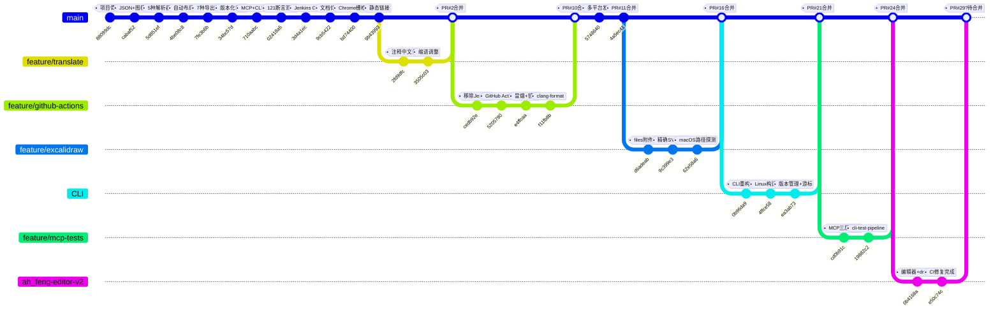

# graphmcp 项目开发日志

> 项目启动日：2026-07-05 — 最后更新：2026-07-10
> 总提交数：140 | 贡献者：6 人
> 技术栈：C++17 · 零第三方依赖 · 单可执行文件 · 双模式（CLI+MCP）

---

## 第一章：项目总览

### 项目简介

graphmcp 是一个 C++17 编写的图形设计与绘图 MCP 工具。所有格式（Mermaid / Markdown / CSV / XML / Excalidraw / Drawio）先归一到统一图模型，再从模型出发做校验、布局、导出。N 种输入 × M 种输出的转换矩阵被压缩为一组 `parse* → Graph → to*` 函数对。

### 基本信息

| 指标 | 值 |
|------|-----|
| 项目周期 | 2026-07-05 ~ 2026-07-10（6 天） |
| 总提交数 | 140 |
| 贡献者总数 | 6 人（含 bot） |
| 当前代码行数 | ~11,933 行（src/ + tests/） |
| 当前 MCP 工具数 | 25 |
| 当前 CLI 命令族数 | 13 |
| 输入格式 | mermaid / markdown / csv / xml / excalidraw / drawio / model / auto |
| 输出格式 | drawio / mermaid / excalidraw / svg / png / pdf / url / model |

### 贡献者贡献分布

| 贡献者 | 提交数 | 占比 | 主要贡献领域 |
|--------|--------|------|-------------|
| wldxiaobai | 76 | 54.3% | CI/CD、冒烟测试、格式排版、Excalidraw 导出体系、CLI 重构、MCP 三层测试、文档 |
| wyQuQ | 28 | 20.0% | CLI 重构、版本管理、游标系统、代码审查修复、指令参考文档 |
| kliang | 17 | 12.1% | 项目搭建、核心引擎（JSON/模型/解析器/导出器/存储/MCP/CLI） |
| yifengsun | 14 | 10.0% | 外部编辑器调起、drawio 解析回导、CI 冒烟测试完善 |
| copilot-swe-agent[bot] | 3 | 2.1% | 自动修复（空指针守卫、draft-commit 功能） |
| Hu kailiang | 2 | 1.4% | 初始仓库设置 |

---

## 第二章：开发阶段划分总览

| 阶段 | 名称 | 起止日期 | 提交数 | 核心交付 |
|------|------|---------|--------|---------|
| P1 | 核心引擎搭建 | 07-05 | 11 | JSON/模型/5种解析器/7种导出器/存储/MCP/CLI/测试/CI/文档 |
| P2 | 加固与中文化 | 07-06 | 6 | 注释中文化、.gitignore 完善、Chrome/Edge 栅格化、浏览器启动修复 |
| P3 | CI/CD 工程化 | 07-07 | 20 | GitHub Actions CI、制品发布、clang-format、cppcheck、空指针守卫 |
| P4 | Excalidraw 白板体系 | 07-08 | 20 | 精确 SVG 导出、freedraw 矢量笔迹、内嵌字体、files 附件、白板冒烟 |
| P5 | 架构重构 | 07-09 | 30+ | CLI 12命令族重构、Draft-Stage-Commit版本管理、Cursor游标、MCP三层测试 |
| P6 | 外部编辑器闭环 | 07-09~10 | 14 | 编辑器自动发现、drawio 解析回导、graph_open/graph_import 冒烟 |

### 阶段划分理由

- **P1**：以项目骨架搭建为主线，11 个提交从 `scaffolding` 开始，以 `docs` 结束，覆盖所有核心模块
- **P2**：主题切换为注释翻译 + 构建修复，提交密度降低
- **P3**：信号密集区 — 从 `移除 Jenkins` 开始，到 `Merge pull request #11` 结束，CI/CD 体系建立
- **P4**：Excalidraw 导出重写（`feat(exporters): 完善白板精确导出` 为标志性提交），17 个提交集中在 exporters.hpp
- **P5**：架构拐点 — `version_manager.hpp` 和 `cursor_types.hpp` 新增，`main.cpp` 大规模重写（+1467/-），MCP 工具从 8 跃升至 24
- **P6**：编辑器功能从 ah_feng 分支开始，最终合并到 main，围绕 exporters.hpp + parsers.hpp 扩展

---

## 第三章：Commit 历史图

---

## 第四章：逐阶段详述

## P1: 核心引擎搭建（2026-07-05）

### 目标与背景

一天内完成 graphmcp 从零到可运行的全部搭建。设计决策：零第三方依赖，所有基础库（JSON 解析/序列化、Base64 编码、XML 解析）手写实现，统一图模型居中。

### 提交清单

| Hash | 作者 | 日期 | 摘要 |
|------|------|------|------|
| `88099dc` | kliang | 07-05 | chore: project scaffolding (Makefile, CMake, gitignore) |
| `cabaf52` | kliang | 07-05 | feat: minimal JSON library and unified graph model |
| `5d851ef` | kliang | 07-05 | feat: input parsers for mermaid, markdown outline, CSV, XML, excalidraw |
| `4be08c8` | kliang | 07-05 | feat: automatic layout engine and graph validation |
| `7fe3b6b` | kliang | 07-05 | feat: exporters for drawio, mermaid, excalidraw, SVG, URL, PNG/PDF |
| `34bc57d` | kliang | 07-05 | feat: versioned JSON store with history and rollback |
| `710aabc` | kliang | 07-05 | feat: MCP stdio server and CLI entry point |
| `02418a5` | kliang | 07-05 | test: unit tests (121 assertions) and example inputs for all formats |
| `3d4a1ec` | kliang | 07-05 | ci: Jenkins pipeline, Ansible deployment, SonarQube configuration |
| `9cb5422` | kliang | 07-05 | docs: README, architecture notes, project mindmap, work log |
| `bd74400` | kliang | 07-05 | feat(export): auto-use installed Chrome/Edge for PNG/PDF rasterization |
| `9b43993` | kliang | 07-05 | fix(export): launch browser via CreateProcessW and static-link the binary |

### 模块变化

| 模块 | 状态 |
|------|------|
| `src/json.hpp` | ~500 行：递归下降解析器，`\uXXXX` 代理对→UTF-8，对象保持插入顺序 |
| `src/model.hpp` | ~300 行：Graph/Node/Edge 结构体 + `toJson`/`fromJson` 序列化 |
| `src/parsers.hpp` | ~700 行：5 种解析器（Mermaid/Markdown/CSV/XML/Excalidraw）+ `parseAny` 统一入口 |
| `src/layout.hpp` | ~200 行：Kahn 分层布局 + 校验（重复ID/悬空边/层级环/孤立点） |
| `src/exporters.hpp` | ~1300 行：7 种导出器，含 Chrome/Edge 无头栅格化 |
| `src/storage.hpp` | ~200 行：`index.json` 目录 + 每图 `latest.json` + `versions/vN.json` 快照 |
| `src/mcp.hpp` | ~400 行：JSON-RPC 2.0 stdio 服务，8 个 MCP 工具 |
| `src/main.cpp` | ~300 行：9 个 CLI 子命令 |
| `tests/test_main.cpp` | 121 个 CHECK 宏断言 |

### 关键决策

- **零依赖策略**：手写 JSON/XML/Base64，避免引入 nlohmann/pugixml/libpng 等依赖
- **统一图模型居中**："N 种输入 → Graph → M 种输出"架构，新增格式只需写一个函数对
- **单文件模块**：每个模块一个 `.hpp`（inline 实现），编译为单个可执行文件
- **Mermaid 子集支持**：仅 flowchart/mindmap/erDiagram，明确放弃时序图/甘特图
- **PNG/PDF 无转换器回退 SVG**：转换器优先级 inkscape → rsvg-convert → magick → Chrome/Edge 无头，均无则写 `.svg` 兜底

### 遗留问题

- P1 结束时 `third_party/` 目录为空，Excalidraw 导出依赖 rough.js（后于 P4 移除）
- 无代码格式化工具（clang-format 于 P3 引入）
- 无 CI/CD（Jenkins 配置于 P1 末尾提交但于 P3 移除改为 GitHub Actions）

---

## P2: 加固与中文化（2026-07-06）

### 目标与背景

P1 完成核心功能后，进入代码质量提升阶段：注释英译中、构建修复（静态链接）、`.gitignore` 完善。

### 提交清单

| Hash | 作者 | 日期 | 摘要 |
|------|------|------|------|
| `d07f9c5` | Hu kailiang | 07-06 | Initial commit（远程仓库初始化） |
| `be56c42` | Hu kailiang | 07-06 | initial Change |
| `60b844a` | kliang | 07-06 | Merge remote-tracking branch 'origin/main' |
| `2fd9dfc` | wldxiaobai | 07-06 | docs(src): 统一翻译源码英文注释 |
| `3505c03` | wldxiaobai | 07-06 | docs(src): Tweak indentation |
| `51fb54e` | kliang | 07-06 | chore: add out/ to .gitignore |

### 模块变化

- 所有 `src/*.hpp` 和 `src/main.cpp`：英文注释 → 中文注释
- Makefile：MinGW 静态链接 `-static -static-libgcc -static-libstdc++`

### 关键决策

- 注释中文化：团队统一中文注释标准，后续代码续写遵循中文注释规范
- 多远程仓库：GitHub（Wuqiongxiaolain/MCP）作为主仓库

---

## P3: CI/CD 工程化（2026-07-07）

### 目标与背景

Jenkins 配置被移除（作为原项目模板残留），替换为 GitHub Actions。引入 clang-format 代码排版、cppcheck 静态检查、制品发布流水线。

### 提交清单

| Hash | 作者 | 日期 | 摘要 |
|------|------|------|------|
| `e105ed3` | wldxiaobai | 07-07 | chore: 将 docs/MiniTasks 纳入 gitignore |
| `cedb92e` | wldxiaobai | 07-07 | chore(ci): 移除 Jenkins 与 Ansible 部署配置 |
| `a469d06` | wldxiaobai | 07-07 | docs(readme): 精简 README 并链接 docs 文档 |
| `5205780` | wldxiaobai | 07-07 | ci: 添加 GitHub Actions 持续集成工作流 |
| `e4ffcaa` | wldxiaobai | 07-07 | ci(workflow): 增强冒烟测试并加入 GitLab 镜像同步 |
| `93a9a45` | wldxiaobai | 07-07 | fix(ci): 修复冒烟断言并忽略.cursor目录 |
| `6278e71` | wldxiaobai | 07-07 | fix(ci): 修正可选流水线条件与文档说明 |
| `84d4504` | wldxiaobai | 07-07 | fix(ci): 兼容 MCP 冒烟日志的两种 JSON 形式 |
| `4cceb0e` | wldxiaobai | 07-07 | fix(ci): 为 SonarCFamily 分析生成 build-wrapper 输出 |
| `5748640` | wldxiaobai | 07-07 | feat(ci): 添加Tag触发的多平台制品发布流程 |
| `ea42557` | wldxiaobai | 07-07 | fix(ci): 修复Windows发布构建的Make兼容性问题 |
| `ebab1c5` | wldxiaobai | 07-07 | fix(test): 修复 cppcheck 报出的错误与测试告警 |
| `f11fb8b` | wldxiaobai | 07-07 | style(cpp): 启用 clang-format 并统一主要源码排版 |
| `f5ec444` | wldxiaobai | 07-07 | fix(ci): 修复发布流程的Tag删除触发并补充发布前测试 |
| `a5f2cf3` | copilot-swe-agent[bot] | 07-07 | test: guard MCP protocol content assertions from null deref |
| `2d4a9c4` | wldxiaobai | 07-07 | fix(test): 防止MCP协议测试解引用空JSON指针 |
| `be08f15` | wldxiaobai | 07-07 | refactor(exporters): 删除Excalidraw连线端点冗余计算 |
| `287e40e` | wldxiaobai | 07-07 | Merge pull request #10 |
| `4a5ec41` | wldxiaobai | 07-07 | Merge pull request #11 |

### 模块变化

| 模块 | 变化 |
|------|------|
| `.github/workflows/ci.yml` | 新增：Ubuntu CI 流水线（构建→单元测试→冒烟→打包制品） |
| `.github/workflows/release.yml` | 新增：Tag触发多平台制品发布 |
| `.clang-format` | 新增：代码排版配置（WebKit 风格） |
| `src/exporters.hpp` | 删除 Excalidraw 连线端点冗余计算 |
| `tests/test_main.cpp` | 空指针守卫（copilot 自动修复） |

### 关键决策

- **从 Jenkins 迁移到 GitHub Actions**：Jenkins 配置作为模板项目残留被移除
- **GitLab 镜像同步**：作为可选流水线（`GITLAB_MIRROR_ENABLED` 变量控制）
- **SonarQube 静态分析**：`SONAR_ENABLED` 变量控制，需仓库 Secret 配置
- **clang-format 统一排版**：强制所有提交前格式化
- **copilot-swe-agent 首次介入**：自动修复空指针解引用问题

---

## P4: Excalidraw 白板体系（2026-07-08）

### 目标与背景

Excalidraw 导出从 rough.js 近似绘制升级为精确 SVG 矢量化，支持 freedraw 压力感轮廓、文字变换、Base64 内嵌图片、Excalifont 字体。`model.hpp` 新增 `files` 附件保真字段。

### 提交清单

| Hash | 作者 | 日期 | 摘要 |
|------|------|------|------|
| `7cfae70` | wldxiaobai | 07-08 | fix(exporters): 修复Excalidraw箭头标签与白板渲染 |
| `d6adeab` |  wldxiaobai | 07-08 | feat(model): 添加 Excalidraw files 附件保真字段 |
| `9c399e3` |  wldxiaobai | 07-08 | feat(exporters): 完善白板精确导出并移除近似 rough |
| `cf17738` ~ `59c1183`（14 个提交） | wldxiaobai | 07-08 | Excalidraw 持续修复：箭头语义、字体转义、路径探测、SVG 冒烟 |
| `c94d297` | wldxiaobai | 07-08 | Merge pull request #16 — Excalidraw 导出体系完成 |

### 模块变化

| 模块 | 变化 |
|------|------|
| `src/model.hpp` | 新增 `files` 字段（`Json::obj()`），保真 Excalidraw 文件附件 |
| `src/exporters.hpp` | `toSVG` 重写为 `toSVGExcalidraw`（~500 行新增），支持 freedraw/font/image/transform |
| `third_party/` | 引入 Excalifont 等内嵌字体资源 |
| `tests/test_main.cpp` | 新增 `testExcalidrawShapes`、fonts/image/transform 覆盖测试 |
| `tests/smoke_test.sh` | 新增 `fixture-regression` 白板 SVG 比对测试 |
| `docs/examples/` | 重构为 `example_input`/`example_output` 分离目录结构 |

### 关键决策

- **移除 rough.js**：Excalidraw 导出依赖的 `third_party/excalidraw-assets/rough.js` 被移除，自研精确 SVG 矢量化引擎
- **内嵌字体策略**：引入 Excalifont 字体文件作为构建资产，避免用户系统缺字
- **MACOS 路径探测**：`exports.hpp` 新增 `_NSGetExecutablePath` + `realpath` 解析 macOS bundle 资源路径
- **GRAPHMCP_ASSETS 环境变量**：允许用户覆盖资源路径

---

## P5: 架构重构（2026-07-09）

### 目标与背景

这是项目历史上最大的重构。新增 `version_manager.hpp`（717行）和 `cursor_types.hpp`（547行）两个模块。CLI 从简单 `--flag` 结构重构为 `<family> <subcommand>` 格式（12 个命令族）。MCP 工具从 8 个跃升至 24 个。测试体系从单文件扩展到三层。

### 提交清单

| Hash | 作者 | 日期 | 摘要 |
|------|------|------|------|
| `0b96da9` | wyQuQ | 07-08 | CLI重构 + Draft-Stage-Commit版本管理 + Cursor游标操作 + MCP工具补全 |
| `ea3ab73` | wyQuQ | 07-09 | feat: CLI重构+版本管理+游标+白板导出+审查修复 |
| `5ed459c` | wldxiaobai | 07-09 | test(ci): 补全新版 CLI 测试链路 |
| `62299c3` | wldxiaobai | 07-09 | fix(cppcheck): 修复静态检查告警并格式化 |
| `d2235fc` | wldxiaobai | 07-09 | fix(cli): 修复冒烟暴露的 CLI 与白板校验缺陷 |
| `cd0b91c` | wldxiaobai | 07-09 | test(mcp): 补齐单测与冒烟链路 |
| `19882c2` | wldxiaobai | 07-09 | Merge pull request #24 — CLI 测试 pipeline |
| `04e2974` | wyQuQ | 07-09 | docs: 新增CLI & MCP指令参考文档 |
| `2943423` | wldxiaobai | 07-09 | Merge pull request #26 — MCP 三层测试 |

### 模块变化

| 模块 | 变化 |
|------|------|
| `src/version_manager.hpp` | **新增**（717行）：Draft/Stage/Commit 工作流、版本 diff、checkout |
| `src/version_types.hpp` | **新增**（550行）：Version/Commit/Operation 类型系统 |
| `src/cursor_types.hpp` | **新增**（547行）：持久化游标（open/get/move/close） |
| `src/main.cpp` | **大规模重写**（+1467/-）：12 命令族 dispatch 模式 |
| `src/mcp.hpp` | **大幅扩展**（+1262/-）：24 个 MCP 工具（graph_layout/graph_delete/graph_show/graph_diff/graph_status/graph_update/graph_insert/graph_delete_element/graph_draft/graph_stage/graph_commit/graph_checkout/graph_cursor_*） |
| `src/storage.hpp` | 新增 version 管理接口、草稿恢复支持 |
| `tests/test_version.cpp` | **新增**（383行）：版本管理测试 |
| `tests/test_cursor.cpp` | **新增**（301行）：游标测试 |
| `tests/smoke_test.sh` | 新增 99 步 CLI 冒烟 |
| `tests/mcp_smoke.sh` | **新增**（271行）：MCP 协议冒烟 |
| `docs/USER_GUIDE.md` | **新增**（695行）：用户指南 |
| `docs/CLI_MCP_REFERENCE.md` | **新增**（385行）：完整命令参考 |

### 关键决策

- **Draft-Stage-Commit 模型**：借鉴 Git 工作流，实现图的增量编辑。`graph_update/insert/delete` → draft → `graph_stage` → `graph_commit`
- **Cursor 遍历**：持久化游标支持 `graph_cursor_open/get/move/close`，解决大图遍历状态管理
- **`main.cpp` 重写**：从 if-else 链改为 `cmdXxx` 函数族 + family/subcommand 两级 dispatch
- **服务版本号升级**：`SERVER_VERSION` 从 1.0.0 → 1.1.0
- **日志系统引入**：`GRAPHMCP_LOG` 环境变量控制 stderr 结构化日志级别

---

## P6: 外部编辑器闭环（2026-07-09 ~ 2026-07-10）

### 目标与背景

为 graphmcp 添加完整的"外部编辑器调起 → 编辑 → 回导"闭环。新增 6 个编辑器发现函数、draw.io XML 反向解析器、`graph_import` MCP 工具。MCP 工具总数从 24 升至 25。

### 提交清单

| Hash | 作者 | 日期 | 摘要 |
|------|------|------|------|
| `0b4168a` | yifengsun | 07-09 | feat(editor): 外部编辑器调起 + drawio解析回导 |
| `9e7a6f9` | yifengsun | 07-09 | docs: 更新文档 — 外部编辑器调起 + drawio解析回导 |
| `903267a` | yifengsun | 07-09 | merge: 合并 origin/main 最新更改 |
| `a2b7608` | yifengsun | 07-09 | fix(test): 恢复合并丢失的 drawio 解析 + graph_import 测试 |
| `633a086` | yifengsun | 07-09 | feat(test): 完善 MCP graph_open + graph_import 冒烟测试 |
| `dd6fb54` | yifengsun | 07-09 | fix(test): mcp_smoke 工具数 24→25，对齐 graph_import 新增 |
| `e50c74c` | yifengsun | 07-10 | fix(mcp): graph_open 在无编辑器环境始终返回 availableEditors 字段 |

### 模块变化

| 模块 | 变化 |
|------|------|
| `src/exporters.hpp` | 新增 `editorFromEnv`/`findExecutable`/`findDrawioDesktop`/`findVSCode`/`resolveEditor`/`readOpenFile`（~163行）；`openExternal` 重写支持 editor 参数 + 三平台降级 |
| `src/parsers.hpp` | 新增 `parseDrawio()`（~216行）：draw.io XML → Graph 反向解析 |
| `src/mcp.hpp` | 新增 `graph_import` 工具（toolDef + dispatch + handler） |
| `src/main.cpp` | 新增 `import` 命令族 + `cmdImport()` |
| `tests/test_main.cpp` | 新增 `testParseDrawio`/`testDrawioRoundTrip`/`testMcpGraphImport`，扩展 `graph_open` 冒烟至 5 场景 |
| `tests/mcp_smoke.sh` | 工具数断言 24→25 |
| `docs/` | ARCHITECTURE/USER_GUIDE/CLI_MCP_REFERENCE 更新 |

### 关键决策

- **编辑器发现优先级**：`--editor-path` > `GRAPHMCP_EDITOR` > `findDrawioDesktop()`/`findVSCode()` > 交叉兜底 > 系统默认
- **MCP vs CLI 命名**：MCP 工具保持 `graph_open`（与主分支规范对齐），CLI 保持 `edit`
- **`import` 为新命令族**：与 `edit` 配对形成闭环
- **CI 可见性**：`availableEditors` 字段设空字符串兜底，避免无编辑器环境 JSON 结构不一致

---

## 第五章：跨阶段趋势分析

| 指标 | P1 | P2 | P3 | P4 | P5 | P6 |
|------|----|----|----|----|----|-----|
| 源码行数（src/） | ~4,200 | ~4,200 | ~4,300 | ~5,800 | ~9,300 | ~9,793 |
| MCP 工具数 | 8 | 8 | 8 | 8 | 24 | 25 |
| CLI 子命令数 | 9 | 9 | 9 | 9 | 12 | 13 |
| 输入格式数 | 5 | 5 | 5 | 5 | 5 | 6 |
| 输出格式数 | 7 | 7 | 7 | 7 | 8 | 8 |
| 单元测试断言 | 121 | 121 | ~200 | ~250 | ~317 | ~366 |
| 源文件数（src/） | 8 | 8 | 8 | 8 | 10 | 10 |
| CI Job 数 | 0 | 0 | 2 | 2 | 3 | 3 |

### 趋势解读

- **P1→P4**：核心功能密集期。P1 一天建完骨架，P4 Excalidraw 导出体系完善。
- **P5**：增长爆发点。CLI 重写 + 版本管理 + 游标系统一次性注入 ~3,500 行，MCP 工具翻三倍（8→24）。
- **P6**：编辑器闭环收尾。相对小规模增量（+528 行），但打通了 AI→人→AI 的关键回路。
- **工程化**（P3）早于功能爆发（P5），CI 和 lint 先于大规模重构介入，保证了代码质量底线。
- **exports.hpp** 从 P1 的 ~1,300 行膨胀到 P6 的 2,262 行，成为项目最大的单一模块和拆分候选。

---

## 第六章：技术债地图（当前状态）

### TODO/FIXME/HACK 清单

**当前无遗留 TODO/FIXME/HACK**（`grep -rn "TODO\|FIXME\|HACK" src/ tests/` 返回空结果）。

> 注：P6 开发过程中移除了 P5 留下的 `ENABLE_GRAPH_OPEN_TEST` Flag（`tests/test_main.cpp:646`），所有被屏蔽的功能已恢复 CI 测试。

### 超大文件警告

| 文件 | 行数 | 风险 | 建议 |
|------|------|------|------|
| `src/exporters.hpp` | 2,262 | 🔴 严重 | 集成了 7 种导出格式 + 编辑器发现 + 浏览器启动 + Base64 + XML 转义 + 文件 IO。建议拆分为 `export_drawio.hpp`、`export_svg_excalidraw.hpp`、`editor_launch.hpp` |
| `src/main.cpp` | 1,557 | 🟡 注意 | 12 个 `cmdXxx()` 函数集中在一个文件，可考虑按功能分组 |
| `src/mcp.hpp` | 1,476 | 🟡 注意 | 25 个 MCP 工具 handler 集中，`ToolRunner` 类逐渐膨胀 |
| `tests/test_main.cpp` | 1,372 | 🟡 注意 | 25 个测试函数 + MCP 集成测试，建议按模块拆分 |
| `src/parsers.hpp` | 1,088 | 无 | 当前 8 种解析器，复杂度可控 |

### 测试覆盖率缺口

| 指标 | 值 |
|------|-----|
| 源码行数 | 9,793 |
| 测试行数 | 2,140 |
| 测试/源码比 | 0.22 |
| 单元测试断言 | 366 |
| 冒烟测试步骤 | 99（CLI）+ 10（MCP） |

- macOS 和 Linux 平台的编辑器探测代码**未在 CI 中验证**（仅 Ubuntu 单平台 CI）
- `parseDrawio()` ER 表格 HTML 解析**仅有基础往返测试**，缺少边界测试
- `import` CLI 命令无专门的 CLI 冒烟测试（仅 MCP 层覆盖）
- 版本管理（version_manager.hpp 717 行）有独立测试（test_version.cpp 383 行），覆盖比良好
- 游标系统（cursor_types.hpp 547 行）有独立测试（test_cursor.cpp 301 行），覆盖比良好

### 下阶段建议优先级

1. **拆分 `exporters.hpp`**（当前 2,262 行）：优先级最高，在继续添加功能前解除单文件膨胀风险
2. **多平台 CI**：增加 macOS runner 覆盖 `.app` bundle 路径和 Homebrew 编辑器探测
3. **编辑器生态扩展**：探测 Inkscape、diagrams.net 在线 URL 生成、Linux Flatpak/Snap 路径
4. **`--watch` 模式**：`edit` 命令添加文件 mtime 轮询 + 自动 `import`，消除手动步骤
5. **Mermaid 时序图支持**：`sequenceDiagram` 是高频需求但需要不同模型抽象
6. **测试覆盖率提升**：将测试/源码比从 0.22 向 0.5 推进，优先覆盖 `parseDrawio` 和编辑器发现

---

> 最后更新：2026-07-10 | 生成方式：基于 `git log --all` 140 条提交自动化分析
