# 🎯 graphmcp：一份图（和表），任意格式进出

> latest update: v0.2.9-beta, 2026-07-17
> 能力口径以 [`openapi.yaml`](api_reference/openapi.yaml)（由 `toolList()` 生成）与当前源码为准。

不管你手上是 Mermaid、Markdown、CSV、XML、Excalidraw 还是 draw.io，丢给 graphmcp，它都能读懂；不管你要 SVG、PNG、PDF、drawio 还是 Excalidraw，它都能吐给你。中间那道「先转 A 再转 B」的手工活，从此不用你自己干。**Graph 模型与 Table 模型地位相同**：各自独立存取版本，再通过桥接工具协作。

**你可能正在遇到这些事**：

- ✍️ 写技术文档，Mermaid 流程图想导出成图片贴进去？
- 🏗️ draw.io 里画好的架构图，想转成 PDF 塞进设计评审文档？
- 🤖 用 Claude Code 写代码时，想让 AI 顺手把架构图 / 规则表也一起改了？
- 📋 从思维导图抽校验规则，检查敌人表枚举是否合法，再一键修回去？

一句话：格式与版本的事交给 graphmcp，你只管画（和填表）。

### Graph 与 Table

系统里有两套并列的一等模型：

| 模型 | 地位 | 存什么 | 典型入口 |
|------|------|--------|----------|
| **Graph** | 一等公民 | 统一图（节点/边/层级/白板元素/颜色…） | `create` / `graph_*` |
| **Table** | 一等公民 | 通用业务表（列/行/hint/版本快照…） | `table create` / `table_*` |

二者各自独立入库、独立版本、独立 MCP/CLI 表面；再通过**有损但可编排的协作链路**对接，例如：

- **图 → 表**：`table_from_graph`（skeleton / edgelist 等投影）、`table_rules_from_graph`（导图抽校验规则）
- **表 → 图**：`graph_from_table`（边表/层级列建图）
- **表内协同**：`table_check` → `table_fix_enums`、`table_align`、`table_derive` / `propose_rows` 等

因此：边表 CSV 进图、业务宽表进 Table——路径不同，地位对等；协作发生在桥接工具上，而不是把 Table 塞进 Graph 里凑合。

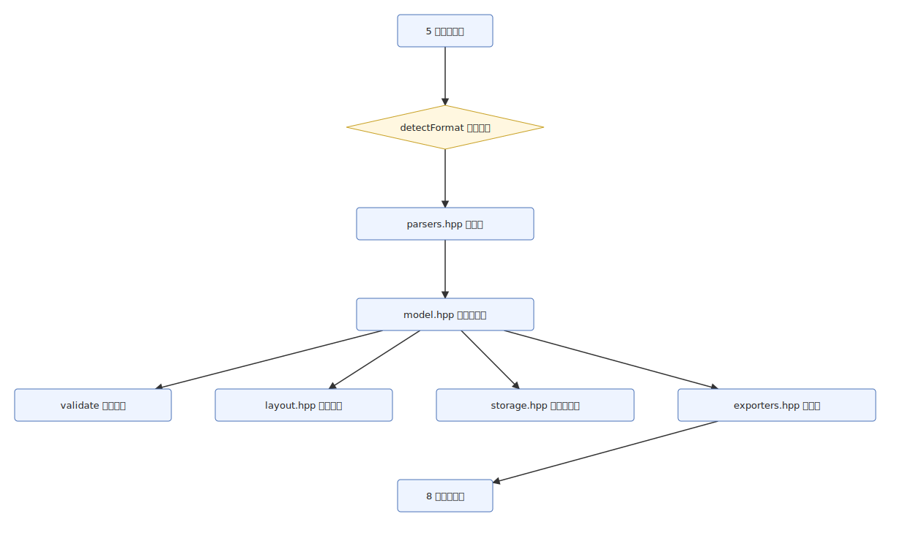

<sub>▲ 这张图本身就是 graphmcp 画的：</sub>

---

## 它能画这六种图

<table>
<tr>
<td align="center"><br><b>流程图</b></td>
<td align="center"><br><b>架构图</b></td>
<td align="center"><br><b>ER 图</b></td>
</tr>
<tr>
<td align="center"><br><b>组织架构图</b></td>
<td align="center"><br><b>思维导图</b></td>
<td align="center">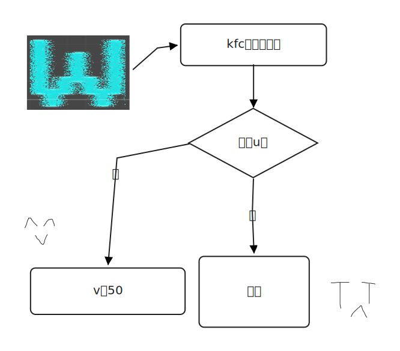<br><b>白板</b></td>
</tr>
</table>

六种业务图共用统一 Graph 模型（节点 / 边 / 层级 / 白板元素 + 颜色字段），格式之间可往返。

### Mermaid 不只三种

`create from-mermaid` / `graph_create` 已覆盖深解析（含但不限于）：

`flowchart` · `mindmap` · `erDiagram` · `classDiagram` · `stateDiagram` · `sequenceDiagram` · `pie` · `requirementDiagram` · `gantt` · `sankey` · `gitGraph` · `kanban` · `journey` · `timeline` · `quadrantChart` · `xychart-beta` · `block-beta` · `architecture-beta` · `packet-beta`

图级结构化扩展可通过 MCP **`graph_property`** 读写。未知类型会明确报错或走透传策略（见样例库硬失败 / 软失败约定）。

---

## 🚀 3 条命令，立刻跑起来

```bash
graphmcp create from-mermaid --file flow.mmd --name "登录流程"
graphmcp export to-svg --id <graph-id> -o output.svg
graphmcp serve                      # 作为 MCP 服务器接入 AI 客户端
```

第一条建图，第二条导出，第三条把它接进 Claude Code / Claude Desktop / Cursor。完整参数见 [CLI &amp; MCP 指令参考](CLI_MCP_REFERENCE.md)；机器可读契约见 [OpenAPI](api_reference/openapi.yaml)；下载与配置见 [Quick Start](QUICK_START.md)。

---

## 🧰 核心能力：格式，你不用操心

### 📥 丢进去就行，不用管它原来是什么格式

Mermaid、Markdown 大纲、**图用** CSV（边表/层级表）、图 XML、Excalidraw、draw.io——可交给 `from-input` / `graph_create(format=auto)`，自动识别。  
**业务宽表**请走 `table create`（CSV 或表 XML，根 `<table>`），不要用 `create from-csv`。

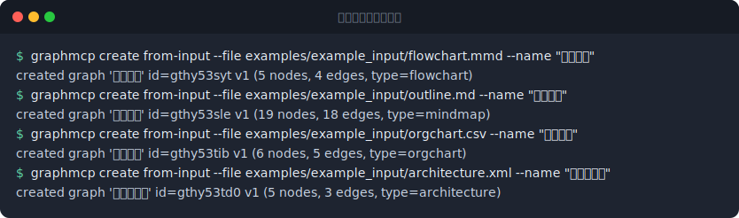

### 📤 一次建模，想要什么格式都有

同一张图，一条命令换格式：`drawio` / `mermaid` / `excalidraw` / `svg` / `png` / `pdf` / `model`（JSON）/ `url`（mermaid.live）。  
对应 MCP：`graph_convert`、`graph_export`。PNG/PDF 依赖本机转换器或浏览器；都没有也会 SVG 兜底，不硬崩。

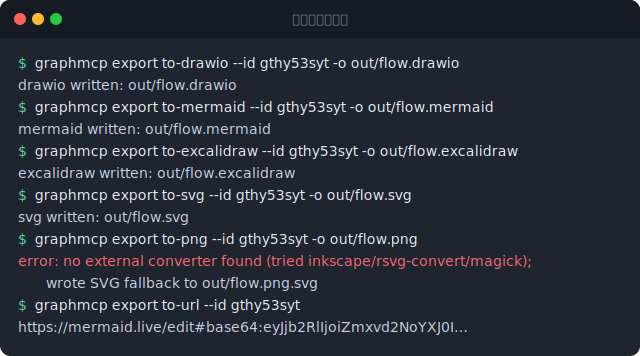

### 📐 排版不用自己摆

`layout auto` 按图类型选策略：分层 / 树水平 / 树垂直 / 网格。MCP：`graph_layout`。

**v0.2.6**：分层布局已增强——层平衡、barycenter 交叉最小化、waypoint 折线路由与边标签定位；复杂图观感尚不完善，仍可按需 `--force` 重排或手动微调后再导出。

可用 MCP 直接改折点与微调几何：`graph_set_edge_route` / `graph_clear_edge_route` / `graph_nudge_node` / `graph_set_edge_heads`，或经 `graph_update` 写边字段 `waypoints`。整图 export/import model **可以**，但是下下策。再次 `graph_layout` 且 `save=true` 仍会覆盖手改。

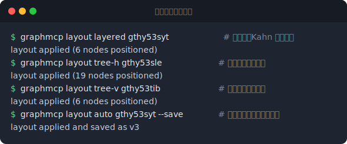

### 🔄 GUI 里改完，一键存回来

`edit with-drawio` / `graph_open` 调起外部编辑器，改完 `import` / `graph_import`——校验、存新版本，改动留痕。

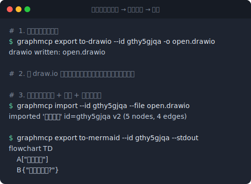

### 🎨 白板转出转入，不失真

Excalidraw 笔迹、图片、字体可原样往返：`elements` / `files` 保留，SVG 走精确路径，离线字体内嵌。


### 🌈 节点/边颜色：一等字段，多格式往返

模型字段：`fillColor` / `strokeColor`（空=默认）。

- **导入**：Mermaid `classDef` / `class` / `style` / `linkStyle`；draw.io；Excalidraw  
- **导出**：SVG / draw.io / Excalidraw / Mermaid（`flowchart` 声明后再写颜色指令）  
- **编辑**：`graph_update` / `graph_insert`（OpenAPI 中均暴露颜色参数）

示例：[`flowchart_colors.mmd`](../examples/example_input/flowchart_colors.mmd)。

### 🧅 多图层 + 多页，draw.io 往返不丢

`parseDrawio` / `toDrawio` 完整保留**图层（layers）**与**多页（pages）**结构。在 Draw.io 中按图层组织、分页管理的复杂架构图，导入 graphmcp 后再导出，结构不丢。节点/边支持 `layer` 归属，导出时按页分组、按图层控制可见性。

---

## 🎯 进阶能力：让「改图」这件事可控

### ✅ 图哪里错了，一眼看出来

重复 ID、悬空边、层级环、孤立节点；状态图允许 `[*]` 作为起始/终止端点。CLI 退出码可接 CI；MCP：`graph_validate`。

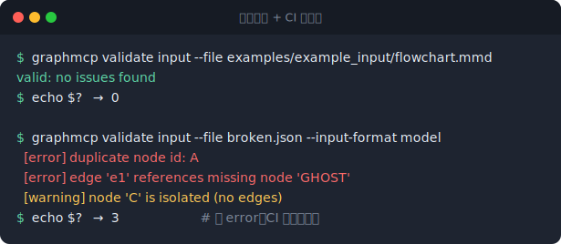

### 🗂 每一次修改都能回溯

Draft → Stage → Commit；`diff` / `checkout` / `rollback`（另存为新版本）。MCP：`graph_draft` / `graph_stage` / `graph_commit` / `graph_diff` / `graph_checkout` / `graph_rollback` / `graph_history` / `graph_status`。

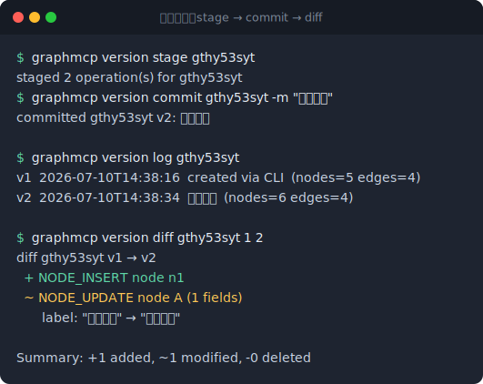

### ✏️ 改一个节点，不用重写整份文件

`graph_update` / `graph_insert` / `graph_delete_element`，支持选择器批量改；图级扩展数据用 `graph_property`。

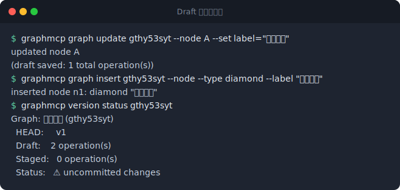

### 🎯 一个节点、一个节点地推进

`graph_cursor_open` / `get` / `move` / `close`：适合 AI「读一项、判一项、改一项」，状态落盘跨进程不丢。

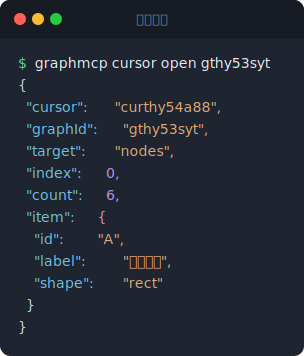

---

## 📋 通用表（Table）

> OpenAPI：`/table_*`、`/graph_from_table`（表相关工具共 20 个）。

| 能力 | CLI / MCP | 说明 |
|------|-----------|------|
| 建表 / 导入导出 | `table_create` · `table_import` · `table_export` | CSV、表 XML（`<table>`）、model JSON；**默认不覆盖**已有 id（可 `force`） |
| 查看与版本 | `table_list` · `table_show` · `table_history` · `table_diff` · `table_rollback` | 表侧同样有版本快照 |
| 批量改表 | `table_update` | `dry_run` / `detail`；单元格按列名或列索引 |
| 图 → 表 | `table_from_graph` | skeleton / edgelist 等有损投影 |
| 表 → 图 | `graph_from_table` | 从边/层级列建图 |
| 跨表对齐 | `table_align` | 按主键补行 |
| 规则与修复 | `table_rules_from_graph` · `table_check` · `table_fix_enums` | 导图抽规则 → 校验 → 按 suggestion 修枚举 |
| 派生与生成 | `table_derive` · `table_transform_column` · `table_sample_rows` · `table_propose_rows` | 如 animation checklist、slug、占位行、结构化提案行 |

可用 Excel「从文本/CSV」互操作；**不实现** Excel 全量 `.xlsx` 读写。样例见 [`examples/README.md`](../examples/README.md)。

---

## 🔌 高级玩法：让 AI 直接帮你改图（和表）

### 🤖 MCP 服务器，51 个工具随时待命

`graphmcp serve` 通过 JSON-RPC 2.0 / stdio 暴露 **51** 个工具（与 OpenAPI `paths` 一一对应）：

| 分组 | 工具（摘要） |
|------|----------------|
| 图生命周期 | `graph_create` · `convert` · `export` · `open` · `import` · `validate` · `list` · `delete` · `layout` |
| 图查看 / 属性 | `graph_show` · `history` · `diff` · `status` · **`graph_property`** |
| Draft 编辑 | `graph_update` · `insert` · `delete_element` · **`graph_apply`** · `graph_set_edge_route` · `clear_edge_route` · `nudge_node` · `set_edge_heads` |
| 版本 | `graph_draft` · `stage` · `commit` · `rollback` · `checkout` |
| 游标 | `graph_cursor_open` · `get` · `move` · `close` |
| 通用表 + 图↔表 | 上表全部 `table_*` / `graph_from_table` |

契约从运行中的 `toolList()` 导出，勿手改 OpenAPI：

```bash
make docs-api    # 或 graphmcp dump-tools --format openapi -o docs/api_reference/openapi.yaml
```

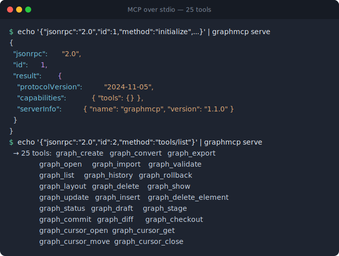

<!-- TODO(本地截图)：在 Claude Code 中实际调用 graph_create 的界面截图，存为 docs/images/mcp-claude-code.png 后替换下一行 -->

<!--  -->

---

## 🔧 技术规格（供技术选型参考）

> 版本以根目录 `VERSION` 为准（当前文档对齐 OpenAPI `info.version`）

| 项 | 现状 |
|----|------|
| 语言 / 产物 | C++17，单可执行文件，零第三方依赖（JSON/XML/Base64 内置） |
| 入口 | CLI 15 命令族 + `serve`；Windows 可静态链接运行时，利于 MCP 裁剪 PATH |
| 版本演进 | v0.1.0 → v0.2.0 → v0.2.2 → v0.2.3-beta → v0.2.4-beta → v0.2.5-beta → v0.2.6-beta → v0.2.8-beta → **v0.2.9-beta**（几何 MCP；布局增强自 v0.2.6） |
| 契约 | OpenAPI 3.0 由 `dump-tools` 生成，CI 防漂移；升版本用 Actions `Bump version` 写回（不自动打 tag） |
| 性能 | 微基准套件 18 指标；CI `bench-ci` 仅比对，按需 Actions `Update bench baseline` 写回 |
| CD | 推送 `v*` tag 触发多平台 Release（Windows/Linux/macOS）；或 CD `workflow_dispatch` 试运行 |
| DevOps | GitHub Actions（主链）+ 本地 Jenkins（Docker + Ansible Runner → nginx 下载站） |

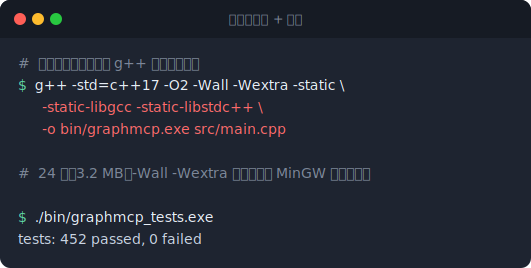

---

完整命令与参数见 [CLI &amp; MCP 指令参考](CLI_MCP_REFERENCE.md)，设计细节见 [应用运作逻辑](APPLICATION_LOGIC.md)，机器契约见 [OpenAPI](api_reference/openapi.yaml)。
