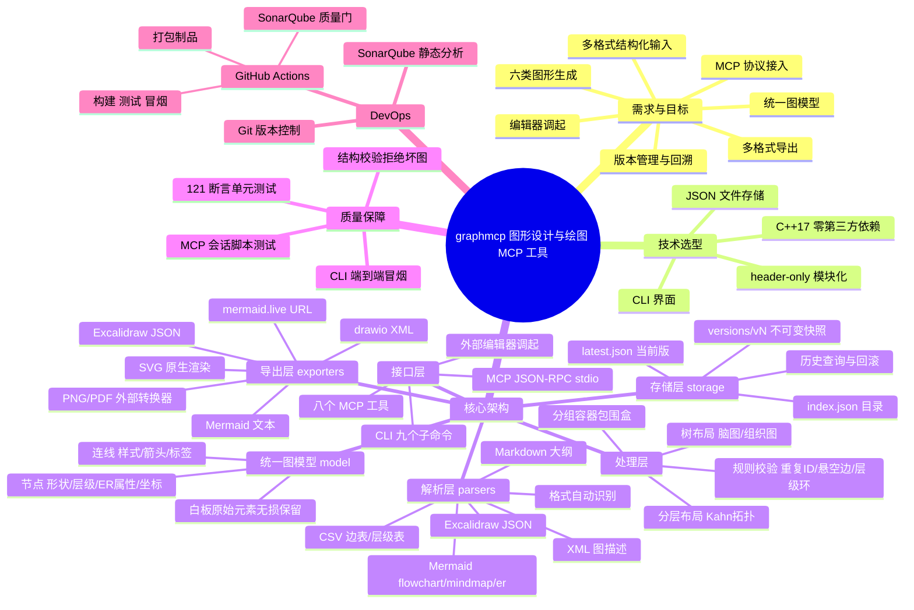

# graphmcp 项目思维导图

> latest update: v0.1.1, 2026-07-10

> 本文件同时是本工具的合法输入：
> `graphmcp create --input docs/MINDMAP.md --name 项目思维导图`
> 即可把这份思维导图导入工具本身并导出为 SVG / drawio / Excalidraw。

## Mermaid 版（可贴入 mermaid.live 查看）

## 大纲版（graphmcp 原生可解析）

# graphmcp 图形设计与绘图 MCP 工具
## 需求与目标
- 多格式结构化输入
- 六类图形生成
- 统一图模型
- 多格式导出
- 编辑器调起
- 版本管理与回溯
- MCP 协议接入
## 技术选型
- C++17 零第三方依赖
- CLI 界面
- JSON 文件存储
## 核心架构
- 解析层：5 种解析器 + 自动识别
- 统一图模型：节点/连线/层级/白板元素
- 处理层：校验 + 布局
- 导出层：6 种格式 + URL
- 存储层：版本化 JSON
- 接口层：CLI + MCP
## 质量保障
- 单元测试 121 断言
- 端到端冒烟测试
- MCP 会话测试
## DevOps
- Git 版本控制
- GitHub Actions 流水线
- SonarQube 静态分析
