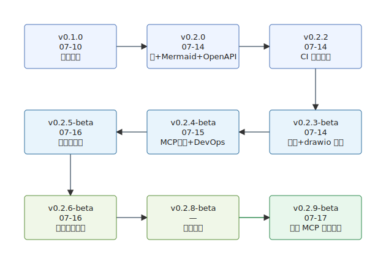

# graphmcp 时间线与里程碑

> latest update: v0.2.9-beta, 2026-07-17

> 项目启动：2026-07-05 — 覆盖至：2026-07-17（版本以根目录 VERSION 为准）  
> 早期阶段（P1–P6）为 07-10 初步收尾；**P7 起为扩展期**，对应 `c6e8009`（macOS CD 恢复）以来及并行合入的表协作 / Mermaid / OpenAPI 等交付。  
> **P11–P13** 为深度工程化阶段，覆盖 MCP 性能重构、drawio 深化、Jenkins DevOps、Ansible Runner 发布链与布局增强。  
> 逐日详情见 [DEV_PROCESS.md](DEV_PROCESS.md)；需求与模块全景见 [PROJECT_OVERVIEW.md](PROJECT_OVERVIEW.md)。

| 阶段 | 名称 | 日期 | 核心交付 |
|------|------|------|---------|
| P1 | 核心引擎搭建 | 07-05 | JSON/模型/解析器/导出器/存储/MCP/CLI |
| P2 | 加固与中文化 | 07-06 | 注释中文化、gitignore |
| P3 | CI/CD 工程化 | 07-07 | GitHub Actions、clang-format、SonarQube、制品发布 |
| P4 | Excalidraw 白板体系 | 07-08 | 精确 SVG、freedraw、内嵌字体、files 附件 |
| P5 | 架构重构 | 07-09 | CLI 多命令族、Draft-Stage-Commit、Cursor、MCP 扩至约 24～25 |
| P6 | 外部编辑器闭环 | 07-09～10 | 编辑器发现、drawio 回导、文档分层；**暂禁** macOS CD（缺头文件） |
| **P7** | **macOS CD + 编辑打磨** | **07-11** | `c6e8009` 补全 macOS 头文件并恢复 CD 构建矩阵；edit/import 提示与导入错误改进（PR #62） |
| **P8** | **OpenAPI 契约** | **07-13** | `dump-tools` / `make docs-api`、OpenAPI 入库、CI 文档漂移校验（PR #65） |
| **P9** | **通用表协作** | **07-13～14** | Table/TableStore、`table_*` MCP/CLI、表 XML、图↔表投影与协同增强（PR #66/#70） |
| **P10** | **Mermaid 深解析 + 颜色** | **07-11～14** | 全类型深解析（19 种）、`graph_property`、颜色全链路（`fillColor`/`strokeColor`/`classDef`/`linkStyle`）、状态图 `[*]` 校验、BOM 处理（PR #64/#71 等） |
| **P11** | **性能重构 + drawio + DevOps** | **07-14～15** | MCP 四维性能改造（存储一致性/写放大削减/超时语义/跨平台回归）；微基准 CI 套件与基线策略重构；drawio 多图层/多页/形状扩展/边标签定位（PR #80）；Jenkins 本地 DevOps 链（Docker/Ansible/nginx）（PR #84）；v0.2.2～v0.2.4-beta（PR #72/#76/#79） |
| **P12** | **Ansible Runner 发布收口** | **07-16** | ansible-runner 容器替代 Semaphore（PR #85）；Jenkins → Ansible Runner → nginx 下载站全自动发布链；v0.2.5-beta |
| **P13** | **分层布局增强** | **07-15～16** | 层平衡、barycenter 交叉最小化、waypoint 折线路由与边标签定位（PR #78）；v0.2.6-beta（尚不完善） |
| **P14** | **MCP 几何原子编辑** | **07-17** | `graph_set_edge_route` / `nudge_node` / `set_edge_heads` 等；`graph_update` 支持 waypoints；优先原子改，整图 model 往返为下下策（v0.2.9-beta） |

## 扩展期结果对照（截至 07-17）

| 维度 | 07-10 收口（历史） | 当前（扩展期后） |
|------|-------------------|------------------|
| MCP 工具 | ~25 | **51**（`toolList()` / OpenAPI） |
| CLI | 多命令族（尚未含完整 table 族） | **15** 族（含 `table` / `dump-tools` / `import`） |
| Mermaid | 以 flowchart/mindmap/er 为主 | **19 种子类型**深解析 + 颜色全链路 |
| 通用表 | 无 | CSV / 表 XML + 图↔表协同增强（10 工具） |
| Drawio | 基础 mxCell 往返 | 多图层/多页/形状扩展/边标签定位 |
| 布局 | Kahn / 树 / 网格基础布局 | **分层增强**（层平衡 + barycenter 减交叉 + waypoint 路由，尚不完善） |
| 几何编辑 | 依赖外部编辑器或整图 model | **MCP 原子工具**（折点/微移/箭头 + `graph_apply`） |
| CD | macOS 暂禁 | **macOS Runner 已恢复**（三平台矩阵） |
| 性能 | 无 | 微基准 18 指标 + CI 基线比对 + MCP 热路径优化 |
| DevOps | GitHub Actions 为主 | 双轨并行：GitHub Actions + 本地 Jenkins（Docker/Ansible Runner/nginx） |
| 契约 | 无 | OpenAPI 自动生成 + CI 漂移校验 |
| 版本 | v0.1.0 | **v0.2.9-beta** |

## 版本演进

S 形演进图（由 graphmcp 导出）：

| 版本 | 日期 | 关键交付 |
|------|------|---------|
| v0.1.0 | 07-10 | 初版收尾：CLI/版本/编辑器闭环 |
| v0.2.0 | 07-14 | 通用表 + Mermaid 深解析 + OpenAPI + macOS CD |
| v0.2.2 | 07-14 | CI 策略重构：基线仅比对 + workflow_dispatch |
| v0.2.3-beta | 07-14 | 颜色全链路 + drawio 多图层/多页 + `[*]` 校验 + BOM |
| v0.2.4-beta | 07-15 | MCP 性能重构 + Jenkins DevOps 链 + drawio 审查修复 |
| v0.2.5-beta | 07-16 | Ansible Runner 替代 Semaphore + 发布链收口 |
| v0.2.6-beta | 07-16 | 分层布局增强：层平衡 / barycenter 减交叉 / waypoint 折线路由（尚不完善） |
| v0.2.8-beta | — | 中间发布（以当时 VERSION / OpenAPI 为准） |
| v0.2.9-beta | 07-17 | MCP 几何原子编辑（折点/微移/箭头）；引导优先原子改，整图 model 往返为下下策 |

## 尚未关闭（与进度相关）

| 项 | 说明 |
|----|------|
| draw.io 能力补齐 | 多图层/多页已落地；仍有 draw.io URL schema 等更完整互操作需求 |
| 导出观感与布局打磨 | v0.2.6 已改进分层布局与折线路由，复杂图交叉/间距/观感仍待继续打磨 |
| 大图/大表压力测试 | 已有微基准，缺少超大图/表的端到端负载评估 |
| `exporters.hpp` 拆分 | ~3300 行单文件，导出/编辑器/浏览器混杂 |
| 布局引擎继续完善 | 在现有 barycenter / waypoint 基础上继续减交叉、调间距与特殊图类型策略 |
