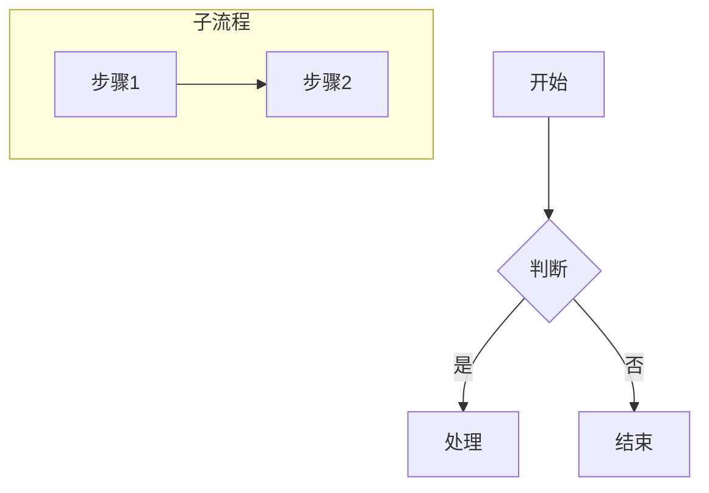
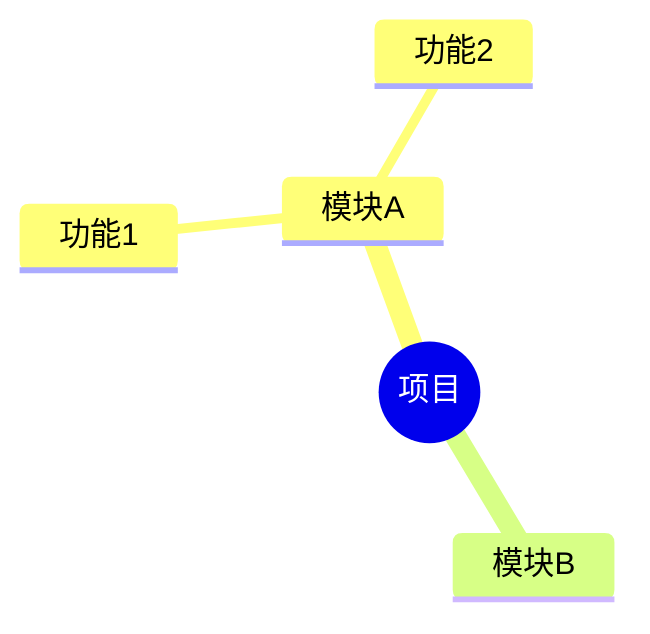
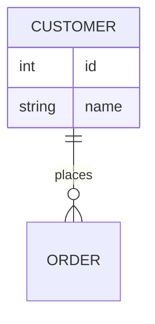

# graphmcp 用户手册

> latest update: v0.1.1, 2026-07-10

> 用户手册（版本以根目录 VERSION 为准）  
> 命令与参数速查（表格）：[CLI & MCP 指令参考](CLI_MCP_REFERENCE.md)

## 这是什么？

**graphmcp** 是一个图形设计与绘图命令行工具。你只需要用文字描述图的结构，它就能自动生成流程图、架构图、ER 图、组织架构图、思维导图、白板草图，并导出为 Drawio、SVG、PNG、PDF 等格式。

**一句话：用文字描述图 → 自动生成可编辑的图形文件。**

---

## 安装（零依赖，一条命令）

```bash
# 编译
make all

# 验证安装
./bin/graphmcp --help
```

构建产物是单个可执行文件，无任何外部依赖。

```bash
# 可选：设置图形存储目录（默认 ./graph-store）
export GRAPHMCP_STORE=/home/me/my-graphs
```

---

## 快速入门（5 分钟）

### 第一步：从文字创建一张图

```bash
graphmcp create from-mermaid --content "
flowchart TD
    A[用户登录] --> B{验证密码}
    B -->|正确| C[进入主页]
    B -->|错误| D[提示重试]
    D --> A
" --name "登录流程"
```

输出：
```
created graph '登录流程' id=g7abc v1 (4 nodes, 4 edges, type=flowchart)
```

### 第二步：导出为 SVG 图片

```bash
graphmcp export to-svg --id g7abc --output login.svg
```

### 第三步：用 Draw.io 打开编辑

```bash
graphmcp edit with-drawio --id g7abc
```

在 Draw.io 中修改图形，保存后回到终端。

### 第四步：将编辑结果导回图库

```bash
graphmcp import --id g7abc
# -> imported '登录流程' id=g7abc v2 (4 nodes, 4 edges)
```

### 第五步：生成在线预览链接

```bash
graphmcp export to-url --id g7abc
# -> https://mermaid.live/edit#base64:...
```

---

## 完整命令参考

命令通用格式：

```
graphmcp <命令族> <子命令> [参数...]
```

共 **10 个命令族**（含新增的 import 编辑回导）。以下按族逐一说明。

---

### 一、create — 创建图形

从输入源创建图并存入版本库。

**支持的输入格式：**

| 子命令 | 输入格式 | 示例文件 |
|--------|---------|---------|
| `from-mermaid` | Mermaid 文本 (flowchart/mindmap/erDiagram) | `examples/flowchart.mmd` |
| `from-markdown` | Markdown 大纲 (标题+列表) | `examples/mindmap.md` |
| `from-csv` | CSV 边表或层级表 | `examples/orgchart.csv` |
| `from-xml` | XML 图描述 | `examples/architecture.xml` |
| `from-excalidraw` | Excalidraw JSON | `examples/whiteboard.excalidraw` |
| `from-model` | 统一模型 JSON | — |
| `from-input` | 自动识别格式 | 任意以上格式 |

**常用参数：**

| 参数 | 说明 | 默认值 |
|------|------|--------|
| `--file <路径>` | 输入文件路径 | — |
| `--content <文本>` | 直接传入内容 | — |
| `--name <名称>` | 图的可读名称 | 自动生成 |
| `--type <类型>` | flowchart / architecture / er / orgchart / mindmap / whiteboard | auto |
| `--no-validate` | 跳过结构校验 | false |
| `--no-layout` | 跳过自动布局 | false |
| `--note <备注>` | 版本备注 | — |

**示例：**

```bash
# 从文件创建
graphmcp create from-mermaid --file examples/flowchart.mmd --name "登录流程"

# 从命令行文本创建
graphmcp create from-input --content "flowchart TD\nA-->B" --name "简单图"

# 从管道输入
cat my-diagram.mmd | graphmcp create from-mermaid --name "管线图"

# 指定图类型（覆盖自动检测）
graphmcp create from-csv --file data.csv --type orgchart

# 不自动布局（保留手动坐标）
graphmcp create from-xml --file manual.xml --no-layout
```

---

### 二、convert — 格式转换（不入库）

纯格式转换，不经过存储层，输入直接变输出。

| 子命令 | 功能 |
|--------|------|
| `convert to-drawio` | 转为 Drawio XML |
| `convert to-mermaid` | 转为 Mermaid 文本 |
| `convert to-excalidraw` | 转为 Excalidraw JSON |
| `convert to-svg` | 转为 SVG 矢量图 |
| `convert to-png` | 转为 PNG 位图 |
| `convert to-pdf` | 转为 PDF 文档 |
| `convert to-url` | 生成 mermaid.live 在线链接 |
| `convert to-model` | 转为统一模型 JSON |

| 参数 | 说明 | 默认值 |
|------|------|--------|
| `--file <路径>` | 输入文件 | — |
| `--content <文本>` | 输入文本 | — |
| `--input-format <格式>` | 输入格式 | auto |
| `--output <路径>` | 输出文件路径 | stdout |
| `--stdout` | 强制输出到 stdout | — |

**示例：**

```bash
# Mermaid -> SVG
graphmcp convert to-svg --file input.mmd --output diagram.svg

# XML -> Drawio
graphmcp convert to-drawio --file architecture.xml --output arch.drawio

# 生成在线预览链接
graphmcp convert to-url --file flowchart.mmd
# -> https://mermaid.live/edit#base64:...

# 管道：读取 stdin，输出到 stdout
cat input.mmd | graphmcp convert to-model --stdout
```

---

### 三、export — 从存储导出

从已入库的图中导出为指定格式。

| 子命令 | 功能 |
|--------|------|
| `export to-drawio` | 导出为 Drawio 文件 |
| `export to-mermaid` | 导出为 Mermaid 文本 |
| `export to-excalidraw` | 导出为 Excalidraw JSON |
| `export to-svg` | 导出为 SVG |
| `export to-png` | 导出为 PNG |
| `export to-pdf` | 导出为 PDF |
| `export to-url` | 生成在线预览链接 |
| `export to-model` | 导出为模型 JSON |

| 参数 | 说明 | 默认值 |
|------|------|--------|
| `--id <图ID>` | 存储中图的 ID（必填） | — |
| `--version <N>` | 导出指定历史版本 | latest |
| `--output <路径>` | 输出文件路径 | stdout |
| `--stdout` | 强制输出到 stdout | — |

**示例：**

```bash
# 导出为 SVG
graphmcp export to-svg --id g7abc --output final.svg

# 导出为 PNG（需浏览器或转换工具）
graphmcp export to-png --id g7abc --output final.png

# 导出历史版本
graphmcp export to-mermaid --id g7abc --version 2 --stdout
```

---

### 四、edit — 外部编辑器调起

| 子命令 | 功能 |
|--------|------|
| `edit with-browser` | mermaid.live 在线编辑 |
| `edit with-drawio` | 本地 Draw.io 打开 |
| `edit with-excalidraw` | 本地 Excalidraw 打开 |
| `edit with-svg` | 系统默认 SVG 查看器打开 |

| 参数 | 说明 |
|------|------|
| `--id <图ID>` | 图 ID（必填） |
| `--version <N>` | 编辑指定版本 |
| `--editor-path <路径>` | 显式指定编辑器（默认自动探测本机安装） |

```bash
graphmcp edit with-browser --id g7abc
graphmcp edit with-drawio --id g7abc
graphmcp edit with-browser --id g7abc --version 1
```

> **自动发现**：系统会自动探测已安装的 draw.io Desktop 和 VS Code，无需手动配置。
> 也可通过环境变量 `GRAPHMCP_EDITOR` 设置默认编辑器。

---

### 五、import — 编辑回导

将在外部编辑器中修改后的文件重新导入图库，生成新版本。

| 参数 | 说明 |
|------|------|
| `--id <图ID>` | 图 ID（必填） |
| `--file <路径>` | 编辑后的文件（可选，默认自动探测 open.* 文件） |
| `--content <文本>` | 内联内容 |
| `--format <格式>` | 输入格式（默认自动检测） |

```bash
graphmcp import --id g7abc                     # 自动探测 open.drawio
graphmcp import --id g7abc --file edited.drawio # 指定文件
graphmcp import --id g7abc --content "flowchart TD\nX-->Y" --format mermaid
```

> **编辑闭环**：`edit with-drawio --id X` → 编辑保存 → `import --id X` → 版本 +1

---

### 六、layout — 布局计算

独立触发图的自动布局。

| 子命令 | 布局策略 | 适用场景 |
|--------|---------|---------|
| `layout auto` | 自动选择 | 通用 |
| `layout layered` | Kahn 分层 | 流程图/架构图 |
| `layout tree-h` | 横向树 | 脑图 |
| `layout tree-v` | 纵向树 | 组织图 |
| `layout grid` | 网格 | 无结构图 |

| 参数 | 说明 |
|------|------|
| `--id <图ID>` | 图 ID（必填） |
| `--save` | 布局后保存回存储 |

```bash
graphmcp layout auto --id g7abc --save
graphmcp layout layered --id g7abc
```

---

### 七、validate — 结构校验

检查图结构的完整性：重复 ID、悬空边、层级环、孤立节点。

```bash
# 校验已存图
graphmcp validate graph --id g7abc
# -> valid: no issues found

# 校验输入文件（严格模式）
graphmcp validate input --file broken.mmd --strict
# -> [error] edge 'e1' references missing node 'missing'
```

| 参数 | 说明 |
|------|------|
| `--strict` | warning 也视为错误 |
| `--quiet` | 只输出 error |

---

### 八、store — 存储管理

```bash
graphmcp store list                    # 列出所有图
graphmcp store list --type flowchart   # 按类型过滤
graphmcp store list --format json      # JSON 格式
graphmcp store show --id X             # 查看详情
graphmcp store load --id X             # 输出模型 JSON
graphmcp store delete --id X --force   # 删除图
```

---

### 九、version — 版本管理（类似 Git）

#### 工作流总览

```
                 graph update/insert/delete
    [HEAD]  ──────────────────────────────>  [Draft 草稿]
                                               |
                                        version stage
                                               |
                                               v
                                          [Stage 暂存]
                                               |
                                       version commit
                                               |
                                               v
                                          [新版本 Commit]
```

#### 状态查看

```bash
graphmcp version status <图ID>
# 输出：
# Graph: 登录流程 (g7abc)
#   HEAD:     v3
#   Draft:    2 operation(s)
#   Staged:   0 operation(s)
#   Status:   ⚠ uncommitted changes
```

#### Draft（草稿区）

```bash
graphmcp version draft show <图ID>      # 查看所有未提交的修改
graphmcp version draft reset <图ID>     # 丢弃所有草稿修改
```

#### Stage（暂存区）

```bash
graphmcp version stage <图ID>                    # 暂存全部修改
graphmcp version stage <图ID> --select 0,2,5     # 暂存选定的操作
graphmcp version stage show <图ID>               # 查看暂存区内容
graphmcp version stage clear <图ID>              # 清空暂存区
```

#### Commit（提交）

```bash
graphmcp version commit <图ID> -m "提交说明"        # 提交暂存区
graphmcp version commit <图ID> -m "提交说明" --all  # 跳过暂存，提交全部 draft
```

#### 历史查询

```bash
graphmcp version log <图ID>                        # 版本历史
graphmcp version log <图ID> --limit 5              # 最近 5 条
graphmcp version log <图ID> --format oneline       # 紧凑单行格式
graphmcp version log <图ID> --format json          # JSON 格式
graphmcp version show <图ID>                       # 查看最新版本
graphmcp version show <图ID> --version 2           # 查看指定版本
```

#### 版本对比

```bash
graphmcp version diff <图ID> <版本1> <版本2>               # 文本格式
graphmcp version diff <图ID> <版本1> <版本2> --format json # JSON 格式
```

#### 版本切换

```bash
graphmcp version checkout <图ID> <版本号>          # 切换 HEAD
graphmcp version checkout <图ID> <版本号> --force  # 强制切换（丢弃未保存）
```

---

### 十、graph — 图元素操作（Cursor 增删改查）

对标数据库游标：定位到图 → 选中元素 → 增删改查。

#### 查看

```bash
graphmcp graph show <图ID>                    # 图摘要
graphmcp graph show <图ID> --node <节点ID>     # 节点详情
graphmcp graph show <图ID> --edge <边ID>       # 边详情
graphmcp graph show <图ID> --format json       # JSON 格式
```

#### 更新

```bash
# 更新单个节点
graphmcp graph update --node A --set label="新标签" <图ID>

# 同时更新多个属性
graphmcp graph update --node A --set label="新" --set shape=diamond <图ID>

# 更新边
graphmcp graph update --edge e1 --set style=dashed <图ID>

# 批量更新：所有矩形节点改为圆角
graphmcp graph update --selector "shape=rect" --set shape=round <图ID>

# 批量更新：parent=g1 的所有子节点
graphmcp graph update --selector "parent=g1" --set style="fill:blue" <图ID>

# 设置节点填充色 / 描边色（颜色用专用字段，勿塞进 style）
graphmcp graph update --node A --set fillColor=#eef4ff --set strokeColor=#4a72b8 <图ID>

# 设置边描边色
graphmcp graph update --edge e1 --set strokeColor=#ff6600 <图ID>

# 模糊匹配：label 包含 "Step" 的节点
graphmcp graph update --selector "label~=Step" --set shape=diamond <图ID>
```

#### 插入

```bash
# 插入节点
graphmcp graph insert --node --type rect --label "新步骤" <图ID>

# 带坐标和尺寸
graphmcp graph insert --node --type diamond --label "判断" --position 400 200 --size 120 60 <图ID>

# 带父节点
graphmcp graph insert --node --type round --label "子项" --parent A <图ID>

# 带填充色 / 描边色
graphmcp graph insert --node --type rect --label "高亮" --fillColor #eef4ff --strokeColor #4a72b8 <图ID>

# 插入边
graphmcp graph insert --edge --from A --to n10 --label "下一步" <图ID>

# 插入 ER 属性
graphmcp graph insert --attr --node CUSTOMER --value "string name" <图ID>
```

#### 删除

```bash
# 删除节点（级联删除关联的边）
graphmcp graph delete --node X <图ID>

# 删除边
graphmcp graph delete --edge e3 <图ID>

# 批量删除
graphmcp graph delete --selector "label~=temp" <图ID>
```

**Selector 语法速查：**

| 写法 | 含义 | 示例 |
|------|------|------|
| `id=A` | 按 ID 精确匹配 | 单个元素 |
| `shape=rect` | 按形状匹配 | 所有矩形节点 |
| `label=开始` | 按标签精确匹配 | 标签为"开始"的元素 |
| `label~=Step` | 按标签模糊匹配 | 标签包含"Step"的元素 |
| `parent=g1` | 按父节点匹配 | g1 的所有子节点 |

---

### 十一、serve — MCP 服务

```bash
graphmcp serve
graphmcp serve --store /path/to/store
```

Claude Desktop 配置：

```json
{
  "mcpServers": {
    "graphmcp": {
      "command": "graphmcp",
      "args": ["serve"],
      "env": { "GRAPHMCP_STORE": "/path/to/store" }
    }
  }
}
```

---

## 输入格式速查

### Mermaid 流程图

> 颜色：可用 `classDef` / `class` / `style` / `linkStyle`；模型字段为 `fillColor`/`strokeColor`。样例见 `examples/example_input/flowchart_colors.mmd`。



### Mermaid 脑图



### Mermaid ER 图



### Markdown 大纲（自动转脑图）

```markdown
# 项目
## 模块A
- 功能1
  - 子功能
## 模块B
```

### CSV（边表模式 → 流程图）

```csv
from,to,label
A,B,步骤1
B,C,步骤2
```

### CSV（层级表模式 → 组织图）

```csv
id,label,parent
ceo,CEO,
cto,CTO,ceo
dev,Developer,cto
```

### 通用 CSV 表（图↔表协作，非转图）

业务宽表请用 `table` 命令族，不要用 `create from-csv`（后者只认边表/层级表）：

```sh
graphmcp table create --file examples/example_input/enemy_sample.csv --name enemies
graphmcp table show <table-id>
graphmcp table update <table-id> --add-row "5,新怪,测试,x,√,√,x,小怪"
graphmcp table from-graph --graph-id <mindmap-id> --mode skeleton --with-hint-row
graphmcp table from-table --file examples/example_input/skill_relations.csv
```

人侧若需 Excel：用 Excel「数据 → 自文本/CSV」打开导出的 CSV 即可；本项目不以 `.xlsx` 为权威格式。

通用表命令补充约定：

- `table create`：若指定 `--id` 且已存在，默认拒绝；需 `--force` 才允许覆盖（建议常用 `table import` 做更新导入）。临时兼容：`GRAPHMCP_TABLE_CREATE_LEGACY_UPSERT=1`（仅 `1`/`true` 生效）。
- `table update`：`set_cells`（MCP）支持 `column` 或 `col_index`；弃用别名 `col` 仍可用并返回去重后的 `compat_warnings`。
- `table from-graph`：`csv_preview` 默认前 20 行；截断时含 `hint`，完整内容用 `table export`。
- `table_check`：有 hint 行时默认跳过首行；`GRAPHMCP_TABLE_CHECK_LEGACY_HINT=1`（或 `true`）可使缺省不跳过。也可显式 `--ignore-hint-row` / `--ignore-hint-row=false`。

### 导图 → 规则表 → 校验 / 自动修复（用户故事 1、2、7）

典型编排：

```sh
# 1) 从思维导图抽出规则表（column / allowed / hint）
graphmcp table rules-from-graph --graph-id <mindmap-id>

# 2) 对照规则校验业务表
graphmcp table check <enemy-table-id> --rules <rules-table-id>

# 3) 按 suggestion 自动写回非法枚举（空 suggestion 记入 skipped）
graphmcp table fix-enums <enemy-table-id> --rules-id <rules-table-id>
```

MCP 对应工具：`table_rules_from_graph` → `table_check` → `table_fix_enums`。规则表约定与 `table_check` 一致：`allowed` 用 `|` 分隔。

### 表派生与稳定键（用户故事 9、10）

```sh
# 动画列为 √ 的单元格 → 清单表（编号/名称/动画字段/需求）
graphmcp table derive --source-id <enemy-id> --mode animation_checklist

# 确定性 ASCII slug（不做拼音/翻译）；空结果回退 col_<行号>
graphmcp table transform-column <id> --source-column 名称 --target-column key --transform slug
```

### 改表预览（用户故事 6）

MCP `table_update` 支持 `dry_run=true`（不落盘）与 `detail=true`（逐格 `before`/`after`）。CLI：`table update … --dry-run`。自然语言→补丁仍由客户端 Agent 完成，本工具只负责可审计写入。

### 占位样例与结构化写入（用户故事 1、8）

```sh
# 保守占位：枚举取 allowed 首值；列名含「动画」默认 x；其余 TODO
graphmcp table sample-rows <id> --count 1 --rules-id <rules-id>

# 对象行写入；提供 rules 时非法枚举整批拒绝（不解析自然语言）
graphmcp table propose-rows <id> --rows '[{"编号":"9","名称":"测试","层级":"小怪"}]' --rules-id <rules-id>
```

### 通用表 XML（模式 A，非图 XML）

业务宽表也可用表 XML 导入（根必须是 `<table>`，**不是**图描述用的 `<graph>`）：

```sh
graphmcp table create --file examples/example_input/enemy_sample.xml --format xml --name enemies
graphmcp table export <table-id> --to xml -o enemies.xml
```

方言要点：根属性可带 `id`/`name`/`hasHintRow`；`<columns>/<col>` 定列；`<row>` 用**子元素名或属性名**作列名填值；允许一层嵌套拍扁为 `父.子`（`toXml` 按父标签聚合写出）；同名时子元素覆盖属性。列名须可安全用作 XML 标签（禁止空白与 `<>/&"'=`），否则导入/导出拒绝；重复列名会去重并 warning。未知 `format`/`to` 会报错（不静默回退）。

```xml
<table name="enemies" hasHintRow="false">
  <columns>
    <col>编号</col>
    <col>名称</col>
    <col>层级</col>
  </columns>
  <rows>
    <row>
      <编号>1</编号>
      <名称>爬虫</名称>
      <层级>小怪</层级>
    </row>
  </rows>
</table>
```

维护说明：表 XML 与 CSV 并行解析后进入同一 `Table`；实现上有意少改 `fromCsv`。若两侧装表行为漂移、再增第三种表格式、或需表侧脱离图解析头，应单独做 `xml_util`/`buildTable` 抽离重构（见 `APPLICATION_LOGIC.md`）。

### 图 XML

```xml
<graph type="architecture" name="系统架构">
  <node id="web" label="Web 层" shape="rect"/>
  <node id="svc" label="服务层">
    <node id="db" label="数据库" shape="cylinder"/>
  </node>
  <edge from="web" to="svc" label="HTTP"/>
</graph>
```

---

## 输出格式速查

| 格式 | 对应子命令 | 说明 |
|------|-----------|------|
| Drawio XML | `to-drawio` | 可用 Draw.io 桌面版打开编辑 |
| Mermaid | `to-mermaid` | Mermaid 文本，可粘贴到 mermaid.live |
| Excalidraw | `to-excalidraw` | Excalidraw JSON，可导入 excalidraw.com |
| SVG | `to-svg` | 矢量图，浏览器可直接打开 |
| PNG | `to-png` | 位图（需要浏览器或 inkscape/rsvg/magick） |
| PDF | `to-pdf` | 文档格式（需要浏览器或转换工具） |
| URL | `to-url` | mermaid.live 在线编辑链接 |
| Model | `to-model` | 统一模型 JSON，用于备份和二次处理 |

---

## 常见工作流

### 场景 A：快速出图（创建即导出）

```bash
graphmcp create from-mermaid --file input.mmd --name "我的图"
graphmcp export to-svg --id <返回的ID> --output output.svg
```

### 场景 B：迭代完善（Draft-Commit 工作流）

```bash
# 创建初版
graphmcp create from-mermaid --file v1.mmd --name "设计图"

# 做一些修改
graphmcp graph update --node A --set label="新名称" <图ID>
graphmcp graph insert --node --type rect --label "补充步骤" <图ID>

# 查看修改了什么
graphmcp version draft show <图ID>

# 满意了就提交
graphmcp version commit <图ID> -m "补充了XXX步骤" --all

# 导出
graphmcp export to-drawio --id <图ID> --output v2.drawio
```

### 场景 C：审查回退

```bash
# 查看历史
graphmcp version log <图ID>

# 对比两个版本
graphmcp version diff <图ID> 1 3

# 临时切回旧版本查看
graphmcp version checkout <图ID> 1
graphmcp graph show <图ID>

# 切回最新
graphmcp version checkout <图ID> 3
```

---

## 快速参考卡片

```
┌─ 创建 ─────────────────────────────────────────────┐
│ graphmcp create from-mermaid --file in.mmd         │
│ graphmcp create from-markdown --file in.md         │
│ graphmcp create from-csv --file in.csv             │
│ graphmcp create from-xml --file in.xml             │
│ graphmcp create from-excalidraw --file in.json     │
│ graphmcp create from-input --file in.xxx           │
├─ 转换（不入库）────────────────────────────────────┤
│ graphmcp convert to-svg --file in.mmd -o out.svg   │
│ graphmcp convert to-drawio --file in.mmd -o out.d  │
│ graphmcp convert to-url --file in.mmd --stdout     │
├─ 导出（从存储）────────────────────────────────────┤
│ graphmcp export to-svg --id X -o out.svg           │
│ graphmcp export to-png --id X -o out.png           │
│ graphmcp export to-url --id X                      │
├─ 编辑 ─────────────────────────────────────────────┤
│ graphmcp edit with-browser --id X                  │
│ graphmcp edit with-drawio --id X                   │
│ graphmcp import --id X  # 编辑回导                  │
├─ 校验与布局 ───────────────────────────────────────┤
│ graphmcp validate graph --id X                     │
│ graphmcp validate input --file in.mmd              │
│ graphmcp layout auto --id X --save                 │
├─ 存储管理 ─────────────────────────────────────────┤
│ graphmcp store list                                │
│ graphmcp store show --id X                         │
│ graphmcp store load --id X > backup.json           │
│ graphmcp store delete --id X --force               │
├─ 版本管理 ─────────────────────────────────────────┤
│ graphmcp version status X                          │
│ graphmcp version draft show X                      │
│ graphmcp version commit X -m "msg" --all           │
│ graphmcp version log X                             │
│ graphmcp version diff X 1 2                        │
│ graphmcp version checkout X 1                      │
├─ 元素操作 ─────────────────────────────────────────┤
│ graphmcp graph show X                              │
│ graphmcp graph update --node A --set k=v X         │
│ graphmcp graph insert --node --type rect X         │
│ graphmcp graph delete --node A X                   │
├─ 服务 ─────────────────────────────────────────────┤
│ graphmcp serve                                     │
└────────────────────────────────────────────────────┘
```

---

## 常见问题

**Q: PNG/PDF 导出失败提示 "no external converter found"？**

A: graphmcp 本身不包含 PNG/PDF 渲染引擎。它会自动尝试调用系统已安装的工具：inkscape → rsvg-convert → magick → Edge/Chrome 无头模式。Windows 通常预装 Edge。如果都不存在，会自动回退生成 SVG 文件。

**Q: 如何修改已存储图的名称？**

A: 当前版本可通过导出 model JSON、修改 name 字段、再重新导入来实现。

**Q: 如何找回误删的图？**

A: 图的存储是文件系统目录，删除后无法恢复。建议定期备份 `graph-store` 目录。

**Q: 环境变量有哪些？**

A: 仅 `GRAPHMCP_STORE`，指定图形存储根目录，默认 `./graph-store`。

**Q: 存储目录结构是怎样的？**

A:
```
graph-store/
  index.json                  # 图目录索引
  <图ID>/
    HEAD                      # 当前版本号
    latest.json               # 最新版本模型
    draft.json                # 草稿修改
    stage.json                # 暂存区
    versions/
      v1.json                 # 不可变版本快照
```
