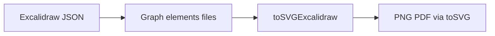

# 代码审查报告_2026_07_08：范围审查至 55e606b

## 范围与结论

共 14 个提交：`files` 保真、精确 SVG（image/crop/仿射/freedraw）、删除近似 rough、字体内嵌与路径探测、CI mermaid/SVG 冒烟。

**总体判断：可合入。** 核心数学与管线正确；上一轮计划里的字体转义 / 非空缓存 / freedraw 笔宽 / 测试补强多数已落地。仍建议尽快修 2 个高优跨平台/CI 隐患。

---

## 做得好的地方

- **files 闭环**：[`src/model.hpp`](src/model.hpp) / [`src/parsers.hpp`](src/parsers.hpp) / `toExcalidraw` / `excalidrawFileDataUrl` 对称。
- **仿射与 crop**：`excalidrawElementAffineByBox`、`resolveExcalidrawImagePlacement` + 内层 `overflow="hidden"` 清晰。
- **转义分层**：`xmlTextEscape`（style）/ `xmlAttrEscape`（font-family）/ `xmlEscape`（通用）划分正确；CSS 保留 `'Excalifont'`。
- **rough 移除干净**：PNG/PDF 走 `toSVG` 再栅格化；相关 RoughHtml 测试已删。
- **CI/fixture**：`--strip-trailing-cr`、[`.gitattributes`](.gitattributes)、[`scripts/update-fixtures.sh`](scripts/update-fixtures.sh)、字体引号正反向断言。

---

## 高优先级建议

### 1. `executableDir` 在 macOS 失效

[`executableDir`](src/exporters.hpp) 非 Windows 分支只用 `readlink("/proc/self/exe")`。macOS 无 `/proc` → 始终空 → `bundledAssetPath` 只靠 CWD/`GRAPHMCP_ASSETS`，字体易静默缺失。

**建议**：`#elif defined(__APPLE__)` 使用 `_NSGetExecutablePath`；保留 Linux `readlink`；失败时仍回退 env/CWD。

### 2. CI `strip_svg_style` 用单行 sed

[`.github/workflows/ci.yml`](.github/workflows/ci.yml) 中 `sed -E 's###g'`：当前 style 多为单行故碰巧能过；一旦 style 换行即误报。

**建议**：改为 `python3` + `re.DOTALL`/`re.sub(r'', '', text, flags=re.S)`，再 `diff`；或固定 `tr -d '\n'` 后再 sed（前者更稳）。

---

## 中优先级建议

### 3. image `href` 转义一致性

约 1103/1111 行仍用 `xmlEscape(dataUrl)`；当前 base64 dataURL 无 `'`，实际无害。语义上双引号属性应统一 `xmlAttrEscape`。

### 4. 箭头嵌字 bounds

`excalidrawCanvasBounds` 对箭头绑定 text 仍用元素原始 `x/y`，渲染却走 `arrowBoundTextBBoxOrigin`。40px pad 常盖住，长折线可能裁切。应对 bound text 用路径中点 bbox 扩边。

### 5. 测试与资源路径探测

已有无 crop image / matrix 符号 / 字体 base64。仍缺：直接测 `bundledAssetPath`（设 `GRAPHMCP_ASSETS`）、`xmlTextEscape`/`xmlAttrEscape` 单测。`update-fixtures.sh` 仅覆盖 4 个文件——与冒烟 diff 对齐即可，不必一次扩全仓库。

### 6. `Store::save` 双重 `toJson`

大 `files` 白板会双倍 base64 序列化；缓存一次 `Json model = g.toJson()` 再 dump/写 snapshot。

---

## 低优先级 / 可接受

- freedraw 无端帽（尖角）：接受为近似，或注释说明非 perfect-freehand 完备移植。
- `rasterizeViaBrowser` 仍在，主路径未用；标注“遗留/调试”或择期删。
- `.gitattributes` 可补 `*.cpp`/`*.hpp`/`*.md` 的 `eol=lf`（非阻塞）。
- crop+flip 黄金对照、粗笔画端帽：需视觉样例，不在本轮硬修。

**明确不做**：不恢复近似 rough / HTML+rough.js 截图。

---

## 建议落地顺序（确认后执行）

1. macOS `executableDir` + 编译宏保护。
2. CI SVG 剥离改为 Python DOTALL。
3. image `href` 改 `xmlAttrEscape`；bound-text bounds 精修。
4. 补 `GRAPHMCP_ASSETS` / escape 单测；`Store::save` 去重 `toJson`（可同 PR 或随后）。
