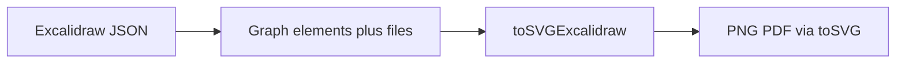

# 代码审查报告_2026_07_08：范围审查建议（d0313f93）

## 范围结论（一句话）

方向正确：`Graph.files` 保真、精确 SVG（含 image/crop、仿射、freedraw 轮廓）、删除近似 rough、CI mermaid 内容比对。整体可合入，但有几处**会静默坏字体 / 裁切笔触**的实现问题值得尽快修。



---

## 做得好的地方

- **files 管线闭环**：[`src/model.hpp`](src/model.hpp) / [`src/parsers.hpp`](src/parsers.hpp) / [`toExcalidraw`](src/exporters.hpp) 透传顶层 `files`；SVG 用 `excalidrawFileDataUrl` 嵌入 `href`。
- **仿射与裁剪**：`excalidrawElementAffine*` + `resolveExcalidrawImagePlacement` + 内层 `<svg overflow="hidden">`，比旧的 clipPath 路线更稳。
- **rough 决策干净**：PNG/PDF 强制精确 `toSVG`，相关 rough 测试已删，避免伪手绘与网页错位。
- **CI**：`diff -q --strip-trailing-cr` + [`.gitattributes`](.gitattributes) 双重兜底 CRLF；whiteboard mermaid 补齐图像边。

---

## 高优先级建议（建议先修）

### 1. `<style>` 里对字体 CSS 做了过度 `xmlEscape`

[`toSVGExcalidraw`](src/exporters.hpp) 约 849 行：

```cpp
os << "    <style>" << xmlEscape(excalidrawEmbeddedFontCss()) << "</style>\n";
```

`xmlEscape` 会把 `'...'` 变成 `&#39;`。浏览器通常能扛，部分栅格化/非 HTML 语义 SVG 消费方会把字面量 `&#39;` 交给 CSS，导致 **`@font-face` 失效**。

**建议**：对 CSS 块只用「XML 文本安全」转义（至少 escape `&` `<` `>`），**不要**转义单/双引号；或把字体 CSS 放进 `CDATA` / 单独不经 `xmlEscape` 的写入路径，并对 `data:`/`base64` 内容做净化假设校验。

附带：`font-family=\"` 属性值里调用 `xmlEscape(excalidrawTextFontFamilyCss(el))` 同样会转义单引号；属性场景应改用**属性专属** escape（`& " <`），或生成不含 `'` 的 `font-family` 列表（例如 `"Excalifont"`）。

### 2. 字体资源路径绑定 CWD + `static` 懒加载不可恢复

[`bundledAssetPath`](src/exporters.hpp) 固定 `"third_party/excalidraw-assets/" + name`；[`excalidrawEmbeddedFontCss`](src/exporters.hpp) 用 `static` 只读一次。工作目录不是仓库根时：`readFile` 空串 → CSS 永久空 → 冒烟 `test -s` 仍绿。

**建议**：

- 解析顺序：环境变量（如 `GRAPHMCP_ASSETS`）→ 可执行文件旁 `../third_party/...` → CWD 相对路径。
- `static` 改为「非空才缓存」；或每次失败可重试（测里断言 CSS 含非空 `base64,` 片段）。

### 3. freedraw 边界未计入笔宽

[`excalidrawCanvasBounds`](src/exporters.hpp) 对 freedraw 只并入中心线点；[`makeFreedrawOutline`](src/exporters.hpp) 轮廓半径约 `strokeWidth/2 * pressure`。厚笔触可能被 `viewBox` 裁掉。

**建议**：bounds 在 freedraw 点上扩展 `maxRadius`（或对 outline polygon 取包围盒）。

---

## 中优先级建议

### 4. 测试偏“字符串存在”，缺关键分支

[`tests/test_main.cpp`](tests/test_main.cpp)：

- image：已覆盖 crop + `overflow="hidden"`；缺 **无 crop** 的 `<image x=...>` 分支；缺 `toDrawio`/`toMermaid` 不崩。
- 变换：只 `matrixCount >= 4`，应至少断言镜像后 matrix 系数符号（如 `scale=[-1,1]` 时 a 为负）。
- 字体：`Excalifont` 字符串存在 ≠ woff2 真读入；应对 `base64,` 后接非空载荷做 CHECK（可配合临时设 `GRAPHMCP_ASSETS`）。
- startOnly 箭头：语义 `from/to` 已测，可加 `toSVG` 上 `marker-end`/`marker-start` 断言。

### 5. CI 比对仍偏脆

[`ci.yml`](.github/workflows/ci.yml) 对 whiteboard **SVG 只检非空**；mermaid 三项全文 `diff`，任何合法空格/节点序变化都要手改 fixture。

**建议**：SVG 至少对关键子串或剥离 `<style>` 后的结构做 diff；或加 `scripts/update-fixtures` 从 `example_input` 一键重生 `example_output`。`.gitattributes` 可补 `*.excalidraw` / `*.drawio` / `*.json` 的 `eol=lf`。

### 6. `exporters.hpp` 体量与重复

大量 `matrix(...)` 手写拼接、`opacity/100` clamp、形状分支；后续可提 `emitMatrixGroup` / `opacity01(el)`，降低漏关 `</g>` 风险。本次审查不要求大拆分，但新功能应避免再复制粘贴。

### 7. 残留资源

计划已删代码引用；本地若仍有未跟踪 `third_party/excalidraw-assets/rough.js`，**删除或明确不提交**，避免后人误接 CDN/HTML 路径。

---

## 低优先级 / 可接受现状

- freedraw `simulatePressure` 从 `i=1` 起改 pressure：与 perfect-freehand 不完全一致，对当前样例影响小。
- crop + flip：需黄金样例/网页对照再动；现有测试不足以判“错”。
- `storage.hpp` 改 `ge::getEnvVar`：方向正确；注意 `exporters`/`storage` 对 getenv 封装的依赖是否形成头循环（现状可接受）。

---

## 建议落地顺序（确认后执行）

1. 修字体 CSS/属性转义；补测试断言 CSS 含真实 base64。
2. 资源路径解析 + 非空缓存；CI 下保工作目录在仓库根（或设 assets env）。
3. freedraw bounds 扩边。
4. 补无 crop image、matrix 符号、可选 SVG 冒烟结构比对与 fixture 脚本。
5. 清理 `rough.js` 未跟踪文件；扩展 `.gitattributes`。

**明确不做**：不恢复近似 rough / HTML+rough.js 截图链路。
