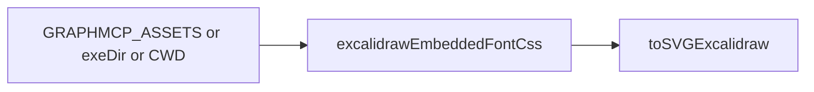

# 代码审查报告_2026_07_08：范围审查 1a56b7a..59c1183

## 范围

7 个提交：字体转义分层、资源路径探测（含 macOS）、freedraw/嵌字 bounds、测试与 CI SVG 剥离、样例同步。

## 总体判断

**无较严重、应阻止合并的缺陷。** 上一审查轮次的高优项（style/`font-family` 引号转义、macOS `executableDir`、CI DOTALL 剥离、href/`Store::save`）均已落地，测试与冒烟方向正确。

---

## 残余建议（中等，非阻塞）

### 1. 字体 CSS「部分成功」会被永久缓存

[`excalidrawEmbeddedFontCss`](src/exporters.hpp) 仅在 `css.empty()` 时重试；若首轮只读到部分 woff2（错误 `GRAPHMCP_ASSETS`、缺失子集），非空字符串仍会写入 `static css`，后续无法补齐。

**建议（择机）**：仅在「必要家族全部加载成功」（或至少 Virgil + Excalifont 主片非空）时缓存；否则返回临时结果且保持 `css` 为空以便重试。或按 `fontFace` 成功数设阈值。

### 2. macOS `_NSGetExecutablePath` 缓冲不足不重试

[`executableDir`](src/exporters.hpp) 在 `size` 不够时直接返回 `""`。极长安装路径上会退回 CWD/env（有兜底，但 exe 旁 `third_party` 探不到）。

**建议（择机）**：返回非 0 时用更新后的 `size` 分配缓冲再调一次。

---

## 明确不需要在本轮当严重问题处理的

- `xmlAttrEscape` 不转义 `>`：属性场景可接受，已有单测约定。
- 测试改 `GRAPHMCP_ASSETS`：顺序单测无妨；勿与并行测试同用。
- CI 只剥 `<style>`：几何比对意图正确；字体引号另有 grep。
- freedraw 无端帽、`rasterizeViaBrowser` 遗留：产品可接受范围，非回归性严重缺陷。

---

## 结论

**可以合入。** 若继续打磨，优先做「完整字体 CSS 才缓存」；其余为加固项。本审查**不默认要求立即改代码**；需要落地时再单开执行任务。
