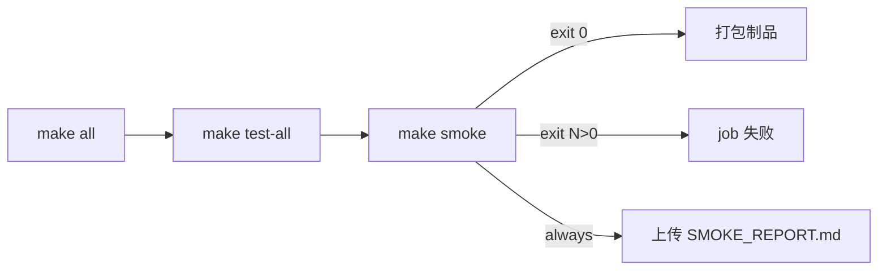

# 代码审查报告_2026_07_09：CI 测试逻辑审查

## 审查范围

| 提交 | 内容 |
|------|------|
| `5ed459c` | 引入新版 CI：`make test-all` + `make smoke`，内联旧冒烟/MCP 脚本删除 |
| `62299c3` | cppcheck/格式化（与 CI 逻辑无关） |
| `d2235fc` | CLI/validate 产品修复 |
| `4313d0b` | 冒烟脚本断言与前置条件修复 |

涉及文件：[`.github/workflows/ci.yml`](.github/workflows/ci.yml)、[`Makefile`](Makefile)、[`tests/smoke_test.sh`](tests/smoke_test.sh)、[`docs/ARCHITECTURE.md`](docs/ARCHITECTURE.md)

---

## CI 工作流本身：无硬伤



- **失败传播正确**：[`tests/smoke_test.sh`](tests/smoke_test.sh) 末尾 `exit $FAILED`，[`Makefile`](Makefile) 直接调用 bash，[`ci.yml`](.github/workflows/ci.yml) 无 `continue-on-error`。
- **单元测试升级合理**：`make test` → `make test-all` 补上 version/cursor 套件；MCP `tools/list` + `graph_create` 等已在 [`tests/test_main.cpp`](tests/test_main.cpp) 的 `testMcpProtocol` / `testMcpExtended` 覆盖（24 工具 list、create/export/status/layout 等）。
- **fixture 回归未丢失**：旧 CI 内联的 workflow/whiteboard/architecture diff 与 SVG 几何比对，已迁入 smoke 的 `[fixture-regression]` 段；`python3` 依赖已在 ci.yml 安装。
- **4313d0b 修复有效**：此前 13 失败中的 grep/参数/version 嵌套/show v2/checkout dirty/validate 样例等问题，属于真实脚本或 CLI bug，非 CI 配置问题。

**结论：当前 CI 不会因为「步骤没跑」或「失败不阻断」而假绿。**

---

## 仍存在的逻辑缝隙（按严重度）

### P1 — `set -e` 与计数式断言冲突

[`tests/smoke_test.sh`](tests/smoke_test.sh) 第 6 行 `set -euo pipefail`，但测试采用 `pass/fail` 计数而非依赖退出码。以下**未加 `|| true` 的前置命令**一旦失败会直接终止脚本，绕过 `fail()` 计数与 `SMOKE_REPORT.md` 生成：

- L167、174、181、207、266：`graph update` / `version draft reset`
- L272–275：`fixture-regression` 的 `convert` 预生成
- L315–316：`legacy-compat` 的 `create`

**影响**：CI 仍会红，但失败形态不可预测（bash 退出码 ≠ 失败项数），artifact 可能缺失。

**建议修复**：对全部 setup/预生成命令统一 `|| true`，或移除 `set -e`（保留 `set -uo pipefail`）。

---

### P2 — PNG/PDF 冒烟可「假绿」

[`run_output_file`](tests/smoke_test.sh)（L79–89）在命令失败（`|| true`）时，只要 `${out%.png}.svg` 存在即 pass：

```bash
"$BIN" "$@" > /dev/null 2>&1 || true
elif [ -s "${out%.png}.svg" ] || [ -s "${out%.pdf}.svg" ]; then
    pass "$label (svg fallback)"
```

CI（ubuntu-latest）通常无 ImageMagick/Chromium，[`exporters.hpp`](src/exporters.hpp) 会写 SVG fallback——**这是产品设计，但 smoke 会把「PNG/PDF 管线损坏」也判为通过**。

**影响**：无法在无头 CI 上验证真实栅格化；旧内联 CI 本就不测 png/pdf，属新增覆盖的软断言。

**建议**（二选一）：
- CI 安装 `imagemagick` 或 chromium，并收紧 `run_output_file` 要求目标扩展名非空；
- 或保留 fallback pass，但在 `SMOKE_REPORT.md` 标注 `(svg fallback)` 计数，便于人工识别。

---

### P2 — MCP 运行时集成覆盖缩水

| 维度 | 旧内联 CI | 新 CI |
|------|-----------|-------|
| MCP initialize | 是 | smoke `[serve]` 仅 initialize |
| tools/list | 是 | **仅单测**（进程内 `handleMessage`） |
| graph_create | 是 | **仅单测** |

**影响**：`graphmcp serve` 的 stdin/stdout 编解码、子进程生命周期等问题，单测无法捕获；smoke 仅 1 条 initialize 管道用例。

**建议**：在 `[serve]` 恢复旧 CI 的三行 JSON-RPC 序列（initialize + tools/list + graph_create），或单独 `make mcp-smoke`（Plan 2 范围）。

---

### P3 — 若干弱断言（已知可接受）

| 用例 | 问题 | 风险 |
|------|------|------|
| `edit with-*` / `legacy open` | 只 grep `opening:`，不验证 `openExternal` | 低：export 失败会非零，`run_stdout_contains` 会抓 |
| `legacy history v1/v2` | 子串匹配 `v1`/`v2` | 低：输出格式固定时够用 |
| `validate broken` | `grep -Fq "error"` 过宽 | 低：当前样例输出 `[error]` |
| `validate strict` | 只断言 stdout 含 `valid: no issues found` | 低：warnings 不导致失败 |

---

### P3 — 相对旧 CI 的覆盖回退

旧内联冒烟有、新 smoke **未显式保留**的项：

- `validate input --file architecture.xml --input-format xml`（fixture 段只 diff mermaid 输出，不单独 validate）
- `workflow.drawio` 作为 **store 图** 的 export 路径（convert fixture 仍覆盖）

**影响**：architecture XML 的 validate 回归仅靠间接 diff，若 validate 逻辑与 convert 脱钩可能漏检。

**建议**：在 `[validate]` 补一条 `validate input --file examples/example_input/architecture.xml --input-format xml`。

---

## 4313d0b 已修复项（确认无逻辑漏洞）

以下项在修复前属于**测试写错**或 **CLI bug**，不是 CI 设计问题；4313d0b 后逻辑自洽：

- `grep -Fq` 修复 `[` 正则
- `$'\n'` mermaid content
- `--position "400 200"`
- `version show --version 2`
- `run_output_contains` + 悬空边 XML（避免 Mermaid 自动补点）
- checkout dirty 前先 `graph update`
- `resolveVersionNested`（d2235fc）修复 draft/stage id
- whiteboard validate 纳入 element id（d2235fc）修复 excalidraw create

---

## 总体结论

| 问题 | 能否「确保 CI 无逻辑漏洞」 |
|------|---------------------------|
| 失败是否阻断合并 | **能** — 工作流与 `exit $FAILED` 正确 |
| 此前 13 项失败根因 | **已修复** — 4313d0b + d2235fc |
| 覆盖是否等价于旧 CI | **基本等价且更广** — CLI 12 命令族 + fixture + legacy |
| 是否存在假绿路径 | **有** — png/pdf svg fallback、MCP serve 浅集成 |
|  harness 是否健壮 | **有隐患** — `set -e` 与计数模式冲突 |

**不能 100% 确保无逻辑漏洞**；当前 CI 适合作为「合并门禁」，但若要做到「缺陷难以漏网」，建议至少修 P1，并按需补 P2 MCP serve 与 architecture validate。

---

## 建议后续改动（可选，按优先级）

1. **P1**：[`tests/smoke_test.sh`](tests/smoke_test.sh) — setup/convert 命令加 `|| true`，或去掉 `set -e`
2. **P2**：[`tests/smoke_test.sh`](tests/smoke_test.sh) `[serve]` — 恢复 tools/list + graph_create 管道测试
3. **P3**：[`tests/smoke_test.sh`](tests/smoke_test.sh) `[validate]` — 补 architecture.xml validate
4. **P2（可选）**：[`ci.yml`](.github/workflows/ci.yml) — 安装 imagemagick 并收紧 png/pdf 断言

不改 [`.github/workflows/ci.yml`](.github/workflows/ci.yml) 主流程亦可；多数缝隙在 smoke harness 层。
