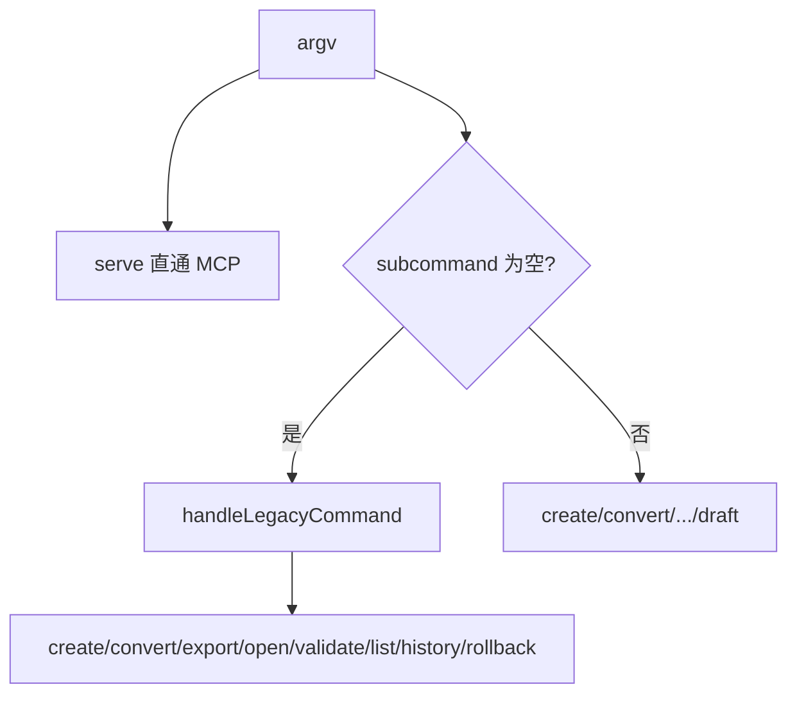
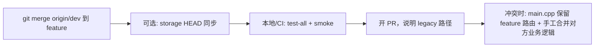

# 代码审查报告_2026_07_09：提交链向后兼容审查

## 提交概览

| Commit | 类型 | 核心变更 |
|--------|------|----------|
| `5ed459c` | test(ci) | CI 改为 `test-all` + `make smoke`；扩展 [`tests/smoke_test.sh`](tests/smoke_test.sh)；新增 export 脚本 |
| `62299c3` | fix(cppcheck) | **大规模 clang-format**（[`main.cpp`](src/main.cpp) +1001 行、`version_types.hpp` +606 行） |
| `d2235fc` | fix(cli) | version 嵌套解析、graph show 缺图报错、`--help`、白板 validate |
| `4313d0b` | test(smoke) | 冒烟断言/参数修复（13 项失败清零） |
| `413fbac` | fix(cppcheck) | cmdVersion 变量遮蔽、游标未读 draft |
| `f66a7d9` | test(ci) | harness 健壮性、MCP serve 管道、imagemagick + `SMOKE_REQUIRE_RASTER` |
| `1ab9daf` | fix(version) | `Commit::fromJson` 读 `note`/`savedAt`（修复 `version show`） |

分支基于 `ea3ab73`（CLI 重构主干），上述 7 提交均在 `feature/cli-test-pipeline` 上叠层。

---

## 向后兼容：已做好的部分



### 1. 旧版扁平 CLI 完整保留

[`handleLegacyCommand`](src/main.cpp)（L232–415）仍处理 8 类旧命令，触发条件：`subcommand.empty()`。新版 `create from-mermaid` 等有子命令，**不与旧版冲突**。

| 旧命令形态 | 新版等价 | 冒烟覆盖 |
|-----------|----------|----------|
| `create --input FILE --id ID` | `create from-input --file` | `[legacy-compat]` |
| `list` | `store list` | legacy |
| `history --id` | `version log` | legacy |
| `rollback --id --version` | 无直接等价（语义不同，见下） | legacy |
| `open --id` | `edit with-browser` | legacy |
| `convert --to X` | `convert to-X` | `[convert]` 新版 |
| `export --id --to` | `export to-X --id` | `[export]` 新版 |
| `validate --id/--input --format` | `validate graph/input` | 新版 + 部分旧参数 |

### 2. 输入/存储格式兼容

- [`readInput`](src/main.cpp) 同时认 `--input` 与 `--file`（L101–102）
- 版本快照仍写 `note`/`savedAt`（[`storage.hpp`](src/storage.hpp) L116–116），`1ab9daf` 在读取侧双字段兼容
- 无 `HEAD` 文件时 [`readHead`](src/version_manager.hpp) 回退 `index.json` 的 `versions` 计数——**纯旧路径创建的图可被新版 version/graph 命令读取**

### 3. MCP 向后兼容

- `graph_rollback` 仍走 `store_.rollback`（[`mcp.hpp`](src/mcp.hpp) L679–689），与旧 CLI 一致
- 冒烟 `[serve]` 已恢复 initialize + tools/list + graph_create 管道集成（`f66a7d9`）

### 4. CI 行为等价且扩展

旧内联 CI 的 fixture diff、MCP 探测、validate 均已迁入 smoke；新增 version/cursor/12 命令族覆盖，**不削弱旧路径检测**。

---

## 向后兼容：剩余风险（建议合并前处理）

### 风险 A — HEAD 文件与旧版 rollback 不同步（高）

| 操作 | 更新 `latest.json` | 更新 `index.versions` | 更新 `HEAD` |
|------|-------------------|----------------------|-------------|
| `store.save`（旧 create/rollback） | 是 | 是 | **否** |
| `store.rollback` / `graph_rollback` | 是（新版本） | 是 | **否** |
| `version commit/checkout` | 是 | 是 | **是** |

**场景**：用户先用 `version checkout` 写入 `HEAD=v1`，再执行旧版 `rollback` 产生 `v4`；`readHead()` 仍返回 `1`，`materializeDraft` / `version status` 基于错误 base。

**建议修复**（小 diff、低冲突）：在 [`storage.hpp`](src/storage.hpp) 的 `save()` 成功返回前、`rollback()` 成功后，同步写入 `<graph-dir>/HEAD`：

```cpp
ge::writeFile(dir + "/HEAD", std::to_string(version));
```

- 与 `GraphVersionManager::writeHead` 行为对齐
- 不破坏纯旧用户（原先无 HEAD，现在自动创建）
- 不影响 `checkout` 回退 HEAD 的语义

### 风险 B — rollback 与 checkout 语义并存（中，文档级）

| | `rollback`（旧） | `version checkout`（新） |
|--|-----------------|-------------------------|
| 行为 | 复制旧快照为**新版本** | 移动 HEAD，**不新建版本** |
| 草稿 | 不清理 draft | 清理 draft/stage（除非 `--force`） |

现有 [`legacy-compat`](tests/smoke_test.sh) 只测 rollback，不测与新版交错。建议在 [`docs/CLI_MCP_REFERENCE.md`](docs/CLI_MCP_REFERENCE.md) 或 [`ARCHITECTURE.md`](docs/ARCHITECTURE.md) 加一句「旧 rollback = 追加版本；新 checkout = 指针移动」。

### 风险 C — 快照字段只写 `note` 不写 `message`（低，已读侧修复）

`1ab9daf` 已修复 `fromJson` 读取。若未来外部工具期望 `message` 字段，可在 `storage.save` 双写（可选，非阻塞合并）。

### 风险 D — 旧版 validate 路径未单独冒烟（低）

旧：`validate --input FILE --format mermaid`  
新：`validate input --file FILE --input-format mermaid`  

legacy handler 仍支持 `--format`，但 smoke 仅测新版。可在 `[legacy-compat]` 加 1 行（可选）。

---

## 合并冲突热点与减压策略

### 高冲突文件（按风险排序）

1. **[`src/main.cpp`](src/main.cpp)** — `62299c3` 整文件格式化 + 后续逻辑补丁；与 `main`/`dev` 并行改动极易冲突
2. **[`src/version_types.hpp`](src/version_types.hpp)** — 同上的格式化 + `1ab9daf` 小改
3. **[`.github/workflows/ci.yml`](.github/workflows/ci.yml)** — `5ed459c`/`f66a7d9` 两次改写
4. **[`tests/smoke_test.sh`](tests/smoke_test.sh)** — 多 commit 累积
5. **[`src/layout.hpp`](src/layout.hpp)** — `d2235fc` 白板 validate（逻辑小、冲突中等）

### 推荐合并流程



1. **合并前先 `merge dev`（或 rebase）**，不要直接 PR 到 main 才发现冲突
2. **解决 `main.cpp` 冲突**：保留本分支的 `handleLegacyCommand` + 新命令族分发；对方若改了旧 handler，逐函数合并而非整文件择一
3. **避免在 PR 中再跑全量 clang-format**；`62299c3` 已格式化，后续只 format 触达行
4. **不要将 62299c3 与逻辑 commit 压成单个 squash**（否则 bisect 困难）；保持现有 7+1 原子提交结构

### 低冲突、可安全先行合入的改动

若需从本分支 cherry-pick 降冲突：
- `d2235fc`、`1ab9daf`、`413fbac` — 逻辑集中、几乎无格式噪音
- `storage.hpp` HEAD 同步 — 独立 2 行，适合单独 commit

---

## 测试覆盖 vs 向后兼容矩阵

| 能力 | 单测 | 冒烟 | 缺口 |
|------|------|------|------|
| 旧扁平 create/list/history/rollback/open | 部分 | legacy-compat | — |
| 旧 convert/export/validate 参数 | 部分 | 新版段间接覆盖 | 旧 `--format` validate 未单测 |
| HEAD 回退逻辑 | readHead 隐式 | 无 | **rollback 后 HEAD 一致性** |
| 新旧交错（rollback → version status） | 无 | 无 | **建议补 1 条** |
| MCP graph_rollback | testMcpProtocol | serve 管道 | rollback 后 HEAD 未测 |
| 存储快照 note/message | testCommitFromStorageSnap | show v2 | 读侧已修复 |

---

## 结论

| 维度 | 评估 |
|------|------|
| 旧 CLI 是否可继续用 | **是** — `handleLegacyCommand` 完整，smoke legacy 段通过 |
| 旧存储是否可读 | **是** — 无 HEAD 时自动回退；`fromJson` 兼容 note |
| 新旧混用是否安全 | **有风险** — HEAD 与 rollback 不同步（建议修） |
| 合并冲突可控性 | **中等** — `62299c3` 格式化是主因；先 merge dev + 按函数解决 |
| 是否建议直接合 main | **修 HEAD 同步 + CI 绿后可合** |

---

## 建议合并前行动（可选实施）

1. **P0**：[`storage.hpp`](src/storage.hpp) — `save`/`rollback` 成功后写 `HEAD`（~4 行）
2. **P1**：[`tests/smoke_test.sh`](tests/smoke_test.sh) — legacy rollback 后 `version status` 断言 HEAD 等于新版本号
3. **P2**：文档补一句 rollback vs checkout 语义差异
4. **P3**（可选）：legacy `validate --input --format mermaid` 冒烟 1 行

完成 P0+P1 后，向后兼容与合并风险可视为**可接受**。
