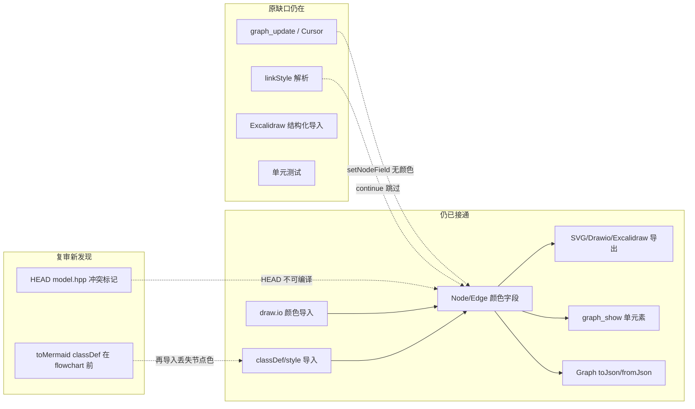

# 代码审查报告_2026_07_14：图颜色全链路提交审查（续）

**审查基线：** 当前工作区 = 提交 [`7117b8c`](7117b8c37ae47ae8eb356f9d3a0c517399813b15)（`feat(color)`）+ 未提交的 [`src/model.hpp`](src/model.hpp) 冲突合并修复  
**相对原计划：** 原对象 `25c1e2e`（约 +178/-21）；现等价提交已 rebase 到 Mermaid 全类型之后，触及 5 文件、约 +1020/-557，但颜色闭环结论未实质改善。

## 状态总览

| 原计划项 | 现状 |
| --- | --- |
| P0 Cursor/Draft 颜色字段 | **未修** — 且 snapshot 路径一并缺失 |
| P0 `linkStyle` 解析 | **未修** |
| P0 颜色自动化测试 | **未修** |
| P1 `rgb()`/`hsl()` 解析 | **未修** |
| P1 Excalidraw 导入颜色 | **未修** |
| P1 draw.io group 描边 | **未修** |
| P1 SVG `xmlEscape` | **未修** |
| P1 `fillColor=none` | **未修** |
| P2 MCP/文档对称 | **未修** |
| （新）`model.hpp` 合并冲突 | **工作区已修，HEAD 仍破** |
| （新）`toMermaid` classDef 顺序 | **新发现，未修** |

---

## 已得到修复 / 有进展的部分

### 1. `model.hpp` 合并冲突（复审新问题 → 工作区已修）

`7117b8c` 在合并 Mermaid 扩展与颜色字段时，把 3 处冲突标记提交进了 [`src/model.hpp`](src/model.hpp)（`Edge` 定义、`toJson`、`fromJson`）。cppcheck 报 `unhandledChar`，代码在 HEAD 上无法正常编译。

**工作区已正确合并两侧字段**（保留 `headStart`/`headEnd`/`seqNum`/`isAsync` + `strokeColor`），但**尚未提交**。  
→ 落地时第一步应提交该修复，否则后续一切审查/CI 都站在坏基线上。

### 2. 原计划「方向正确」部分仍成立（非新修复）

以下在 `7117b8c` 中仍可用，与原审查一致，**不算本轮新修**：

- [`src/model.hpp`](src/model.hpp)：`Node.fillColor`/`strokeColor`、`Edge.strokeColor`；JSON 仅非空序列化
- [`src/parsers.hpp`](src/parsers.hpp)：Mermaid `classDef`/`class`/`style`、draw.io `fillColor`/`strokeColor` 导入
- [`src/exporters.hpp`](src/exporters.hpp)：SVG/Drawio/Excalidraw/Mermaid 导出读模型颜色
- [`src/mcp.hpp`](src/mcp.hpp)：`graph_show` 单节点/边返回颜色

**原 P0–P2 清单中没有任何一项在产品代码里被关掉。**  
`version_types.hpp` 虽出现在 `7117b8c` diff 中，但实际只是格式化，**未接通颜色读写**。

---

## 原问题：仍然存在（按优先级）

### P0 — 仍阻塞「可编辑」与往返

#### 1. Draft/Cursor 字段映射未含颜色（高，未修）

[`src/version_types.hpp`](src/version_types.hpp) 约 429–503 行：`getNodeField` / `setNodeField` / `getEdgeField` / `setEdgeField` 仍无 `fillColor`/`strokeColor`。

进一步确认 snapshot 路径也缺：

- `nodeToSnapshot` / `edgeToSnapshot`（约 687–720）不写颜色
- `NODE_INSERT` / `EDGE_INSERT` 重建（约 597–644）不读颜色

**影响：** `graph_update --set fillColor=#ff0000` 仍会静默 no-op；带色节点经 insert→materialize 也会丢色。

#### 2. Mermaid `linkStyle` 只跳过不解析（高，未修）

[`src/parsers.hpp`](src/parsers.hpp) 约 168–169 行仍 `continue`；[`src/exporters.hpp`](src/exporters.hpp) 约 2093–2097 行仍输出 `linkStyle N stroke:...`。边色 round-trip 仍断。

#### 3. 颜色自动化测试缺失（高，未修）

`tests/` 仍无模型 `fillColor`/`classDef`/`linkStyle`/`graph_update` 颜色断言（仅有白板 freedraw 的 `strokeColor` 元素级用例）。

### P1 — 正确性与健壮性（全部未修）

4. **`parseStyleColors` 遇 `rgb()`/`hsl()` 截断**（约 145–162 行）  
5. **`parseExcalidraw` 结构化节点/箭头不读 `backgroundColor`/`strokeColor`**（约 3227–3265 行只建几何与绑定）  
6. **`drawioStyle` group 分支硬编码**，丢弃 `extra` 中的自定义描边（约 2123–2125 行）  
7. **结构化 `toSVG` 颜色未 `xmlEscape`**（约 2468、2486–2507 行；白板路径已转义）  
8. **draw.io `fillColor=none` 仍原样入库**（约 3136–3154 行）

### P2 — API / 文档（全部未修）

9. `graph_show` 全图摘要 `nodeList`/`edgeList` 无颜色；`graph_insert` schema 未暴露颜色参数  
10. `docs/`、`examples/` 无颜色能力说明；`Node.style` 与专用颜色字段语义重叠  
11. 低优先级：`A:::className`、Excalidraw group `transparent` 文档说明等

---

## 复审新发现（原计划没有）

### N1. HEAD 含冲突标记（P0，工作区已修未提交）

见上文「已得到修复」。**在合入其它颜色修复前必须先提交冲突清理**，否则 `7117b8c` 本身不可用。

### N2. `toMermaid` 将 `classDef`/`class` 写在 `flowchart TD` 之前（P0，新）

[`src/exporters.hpp`](src/exporters.hpp) 约 1994–2024 行：先输出 `classDef`/`class`，再输出 `flowchart TD`。

而 [`parseMermaid`](src/parsers.hpp) 约 2566–2567 行从 `flowchart`/`graph` 行起算，且 `parseMermaidFlowchart(lines, i + 1)` **只扫声明之后的行**。

**影响：**

- 导出再导入时，**节点色 classDef 整段被跳过**（比 `linkStyle` 缺口更严重：节点色往返也断）
- 若文本以 `classDef` 开头，`detectFormat` 也可能认不出 mermaid

**建议：** 先写 `flowchart TD`，再写节点/边，最后写 `classDef`/`class`/`linkStyle`（或全部放在图声明之后）。

### N3. 提交信息与 diff 易误导

`7117b8c` 声称「全链路」且改动含 `version_types.hpp`，但该文件无颜色语义变更；审查时勿把「文件出现在 commit 里」当成「Cursor 已接通」。

---

## 更新后的建议落地顺序

1. **提交** 工作区 [`src/model.hpp`](src/model.hpp) 冲突合并修复（恢复可编译基线）  
2. **修正** `toMermaid` 输出顺序：`flowchart` → 结构 → `classDef`/`class`/`linkStyle`  
3. 接通 [`version_types.hpp`](src/version_types.hpp)：field get/set + snapshot 读写 + INSERT 重建  
4. 实现 `linkStyle` 解析  
5. 加固 `parseStyleColors`（`rgb()`）+ SVG `xmlEscape` + group stroke + Excalidraw 导入色  
6. 补测试（含 classDef 往返、linkStyle、update materialize、drawio）+ 文档/schema

**本计划仍是审查结论与可执行建议**；确认后再按优先级开 PR 改代码。
