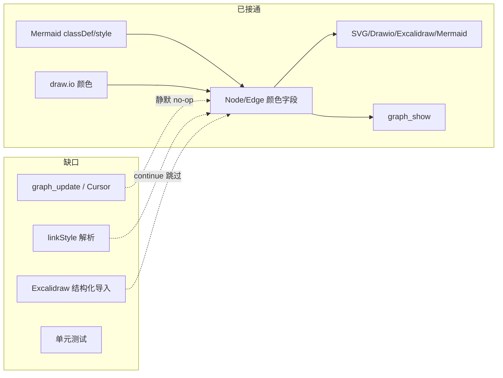

# 代码审查报告_2026_07_14：图颜色全链路提交审查

**审查对象：** `25c1e2eb40b25403a38d197fa83d652346dac4c7`  
**主题：** `feat(color): 图颜色支持 — Node/Edge 填色+描边全链路`  
**范围：** 4 文件，+178/-21（[`src/model.hpp`](src/model.hpp)、[`src/parsers.hpp`](src/parsers.hpp)、[`src/exporters.hpp`](src/exporters.hpp)、[`src/mcp.hpp`](src/mcp.hpp)）

## 总体评价

方向正确：颜色成为一等字段（空串=默认色），JSON 仅非空序列化，SVG/Drawio/Excalidraw/Mermaid 导出与 `graph_show` 读路径已接通。但提交所称「全链路」尚未闭环——**MCP 可写路径、Mermaid 边色往返、自动化测试**仍有明显缺口。



---

## P0 — 建议优先修复（阻塞「可编辑」与往返）

### 1. Draft/Cursor 字段映射未含颜色（高）

[`src/version_types.hpp`](src/version_types.hpp) 中 `getNodeField` / `setNodeField` / `getEdgeField` / `setEdgeField`（约 404–478 行）**没有** `fillColor`/`strokeColor`。

**影响：** `graph_show` 已暴露颜色，但 `graph_update --set fillColor=#ff0000` 会记 Draft、materialize 时却 no-op。

**建议：** 在上述四个函数中补齐读写；同步检查 `nodeToSnapshot` / `edgeToSnapshot` / `NODE_INSERT` rebuild 是否也需带上颜色字段。

### 2. Mermaid `linkStyle` 只跳过不解析（高）

[`src/parsers.hpp`](src/parsers.hpp) 约 165–166 行：

```cpp
if (startsWith(line, "linkStyle"))
    continue;
```

而 [`src/exporters.hpp`](src/exporters.hpp) 约 1446–1450 行会输出 `linkStyle N stroke:#xxx`。

**影响：** Mermaid 边色 round-trip 丢失。

**建议：** 解析 `linkStyle <index> stroke:...`，按边索引写入 `g.edges[i].strokeColor`（注意与 `classDef`/`style` 处理顺序一致）。

### 3. 补充颜色相关自动化测试（高）

仓库 `tests/` 中无针对模型 `fillColor`/`classDef`/`linkStyle` 的断言；提交信息「3/3 测试通过」无法从仓库审计。

**建议最小用例集：**
- Mermaid `classDef` + `class` → 模型颜色正确
- Mermaid `linkStyle` → 边 `strokeColor` 保留（修复后）
- draw.io `fillColor`/`strokeColor` → `toDrawio` 往返
- `Graph::toJson` / `fromJson` 颜色字段
- `graph_update` 设置 `fillColor` 后 materialize 生效（修复后）

---

## P1 — 正确性与健壮性

### 4. `parseStyleColors` 无法处理 `rgb()`/`hsl()`（中）

[`src/parsers.hpp`](src/parsers.hpp) 约 148–154 行用 `find_first_of(",; \t...")` 截断，`fill:rgb(255,0,0)` 会得到 `rgb(255`。

**建议：** 若值以 `rgb(`/`rgba(`/`hsl(` 开头，匹配到对应闭合 `)`；否则再按 `,;` 分割。可抽公共工具函数，与 draw.io 的 `extractStyleVal` 共用校验逻辑。

### 5. `parseExcalidraw` 未读结构化节点颜色（中）

导出 `toExcalidraw` 会写 `backgroundColor`/`strokeColor`，导入端约 1025+ 行未写回 Node/Edge。

**建议：** 从 rectangle/ellipse/diamond/arrow 元素读取颜色写入模型。

### 6. draw.io group 导出忽略自定义描边（中）

[`src/exporters.hpp`](src/exporters.hpp) `drawioStyle` 在 `shape == "group"` 时硬编码返回，丢弃前面组装的 `extra`（含 `strokeColor`）。

**建议：** group 分支也拼接 `strokeColor`（若非空）。

### 7. SVG 颜色属性未 `xmlEscape`（低–中）

白板路径对 `strokeColor` 使用了 `xmlEscape`，结构化图 `toSVG`（约 1796、1814–1845 行）直接拼接。

**建议：** 对所有写入 SVG/XML 属性的颜色值统一 `xmlEscape`，或白名单校验 `#hex` / `rgb(...)` / 命名色。

### 8. `fillColor=none` 原样入库（中–低）

draw.io 分组检测用 `fillColor=none`，但仍写入模型字面量 `"none"`。建议：检测为 group 时将 `fillColor` 置空（表示默认/透明），避免下游误用。

---

## P2 — API 对称性与文档

### 9. MCP 读写不对称
- [`src/mcp.hpp`](src/mcp.hpp)：`graph_show` 单节点/边已返回颜色；全图摘要 `nodeList`/`edgeList` 仍无颜色
- `graph_insert` 未暴露颜色参数

**建议：** 摘要可选带颜色；insert/update schema 与文档同步列出 `fillColor`/`strokeColor`。

### 10. 文档与示例滞后
- `docs/`、`examples/` 未体现颜色能力
- `Node.style` 注释仍写「颜色等」，与专用字段重叠——建议约定：`style` 仅保留线型/遗留提示，颜色以专用字段为准

### 11. 其他小项
- Mermaid 内联 `A:::className` 未支持（低）
- `toMermaid` 第一遍边循环中未使用的 `ei`（低，清理）
- group 在 Excalidraw 中 `fillColor` 被强制 `transparent`——建议在文档中说明

---

## 建议落地顺序（若后续实现）

1. 接通 [`version_types.hpp`](src/version_types.hpp) 颜色字段 + MCP update 验证
2. 实现 `linkStyle` 解析
3. 加固 `parseStyleColors`（`rgb()`）+ SVG `xmlEscape`
4. 补 Excalidraw 导入颜色、draw.io group stroke
5. 加测试 + 更新 CLI/MCP 文档与带色示例

**不建议在本审查阶段直接改代码**——以上为审查结论与可执行建议；确认后再按优先级开 PR。
