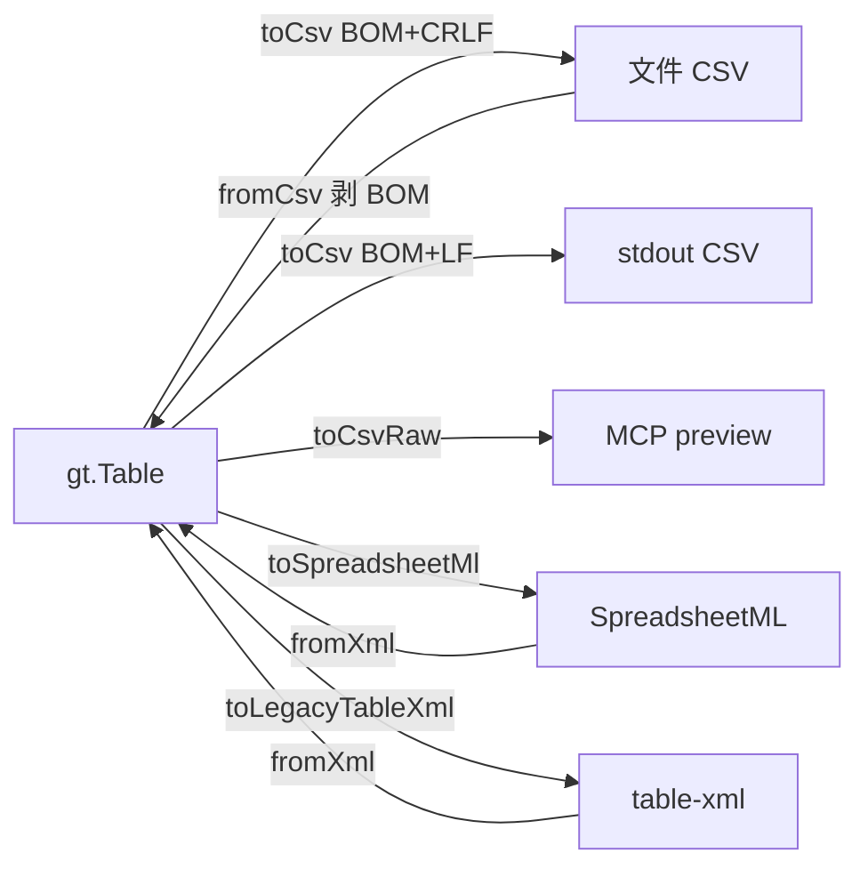

# 代码审查报告_2026_07_17：CSV / 表 XML 导出再审

## 范围

| 批次 | 内容 | 状态 |
|------|------|------|
| PR #88 / `4245ebb` 等 | UTF-8 BOM + CRLF CSV；`--no-bom`/`--lf`；MCP `no_bom`；stdout 防 `\r\r\n` | 已进 `main` |
| `fdb2bb1`…`9179443` | 默认 SpreadsheetML；旧方言兼容；样例迁移 | 分支 `feat/table-spreadsheetml-xml` |
| 工作区未提交 | 单次 parse、`ss:Index`、Keywords 转义、UTF-8 sheet 截断、内嵌测试 | [`src/table_xml.hpp`](src/table_xml.hpp) / [`tests/test_main.cpp`](tests/test_main.cpp) 已改、**尚未 commit** |

---

## 总体评价

**CSV**：人侧双击 Excel 的问题抓得准；`writeFile` 用 binary、stdout 强制 `crlf=false`，Windows 陷阱处理正确；`fromCsv` 剥 BOM 与默认写出对称。

**XML**：SpreadsheetML 作为「仍是 XML 且可进 Excel」的默认语义合理；零依赖与旧方言分层清楚。工作区加固已覆盖上一轮 P0/P1（双重 parse、`ss:Index`、Keywords、码点截断）——**应先提交，再谈后续**。

---

## 仍建议修的问题（按优先级）

### P0 — 行为正确性

**1. SpreadsheetML 表头重复列 → 物理列宽被 `appendColumnUnique` 收缩**

[`readHeaderRow`](src/table_xml.hpp) 先按 `ss:Index` 得到宽度 `W`，再对每个槽位 `appendColumnUnique`。重复列名会 **跳过追加**，`t.columns.size() < W`，随后 `readSparseRow(..., t.columns.size())` 会丢掉右侧单元格。

复现形态：表头 `A,a,a` 或空隙+重复时，数据第 3 列静默丢失（现有测试只断言 `columns.size()==2` 与 warning，未断言数据宽）。

建议（选定）：重复时仍占位，名称改为 `a__2` / `a__3`（或 `a_2`），保证 `columns.size() == W`，并保留 warning。

**2. 工作区加固未入库**

单次 parse / `ss:Index` / Keywords 转义等只在 working tree。合并前应至少 1～2 个 commit（`fix(table)` + 测试），避免 PR 只含初版 SpreadsheetML。

### P1 — API 一致性

**3. MCP `no_bom` 与 CLI 语义不对齐**

- CLI：`--no-bom` 与 `--lf` **独立**（[`csvOptsFromArgs`](src/main.cpp)）。
- MCP：`no_bom=true` → `toCsvRaw()` = **无 BOM 且 LF**（[`tableExport`](src/mcp_table_tools.hpp)），无法「仅去 BOM、仍 CRLF」写文件。

建议：MCP 增加 `lf`（或拆 `CsvWriteOpts`），`exportTableText` 接受完整 opts，而不是单一 `excelCsv` bool。

**4. 旧样例 Keywords 无转义的兼容读**

加固后写出对 `id` 做 `kwEscape`；读侧 `kwUnescape`。无 `%` 的旧导出仍可读。若曾有人手工把未转义且含 `;` 的 id 写进 Keywords，仍会坏——可接受；文档一句即可。

### P2 — 边界与体验

**5. CSV 多行字段无法完整读回**

[`escapeCsvField`](src/csv_util.hpp) 会为含 `\n` 的字段加引号，但 [`fromCsv`](src/table_model.hpp) 先 [`splitLines`](src/model.hpp) 再按行 `splitCsvLine`，**引号内换行会被拆行**。业务宽表少见，但往返不保证。

建议：中期做「引号感知的 CSV 分词」；短期在 USER_GUIDE 写明「单元格勿含裸换行，或改用 model/xml」。

**6. `splitCsvLine` 对字段 `trim`**

导入会去掉首尾空格，与 Excel「保留空格」不完全一致。若游戏表依赖前导空格，会丢。可选：仅 trim 未加引号字段。

**7. SpreadsheetML 仍未覆盖的 Excel 方言**

- `ss:MergeAcross` / 合并单元格  
- `Data ss:Type="Number"` / Formula（当前一律当文本，导出也全是 String——对枚举 `√` 是正确选择）  
- 多 `Worksheet`（已注明只读第一张；USER_GUIDE 可再写一句）

**8. 空表（0 列）写出**

CSV/SML 仍可写出「空表头行」；读回 SML 报 header empty。可与 CSV 一样在 `toSpreadsheetMl`/`toCsv` 对 0 列直接 `TableError`，错误更早。

**9. CLI `table-xml` 无 stderr 提示**

`to=xml` 有 SpreadsheetML note；`to=table-xml` 可加一句「非 Excel 格式」，防误开。

---

## 已做得好的点（无需再改）

- 文件 CSV：BOM+CRLF + binary `writeFile`；stdout：BOM+LF，避免 Windows `\r\r\n`。
- MCP 内联 preview 用 Raw，避免把 BOM 塞进 JSON/对话。
- SpreadsheetML 密铺写出 + Index 稀疏读入（工作区）覆盖「Excel 另存」主风险。
- 格式角色清晰：人侧 csv > xml(SML) > 机器 model；旧方言降级。

---

## 建议落地顺序（follow-up 实现时）

1. **提交**当前工作区 SpreadsheetML 加固与测试。  
2. **修**表头重复列占位（保证列宽 = Index 宽度）。  
3. **对齐** MCP CSV 选项与 CLI（`no_bom` / `lf` 分离）。  
4. 文档：CSV 多行字段限制；SML 只读首 sheet；可选 `table-xml` note。

本审查不修改计划附件文件；确认后按上序实现即可。
