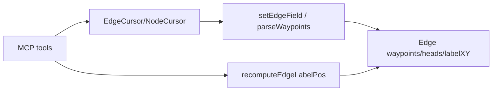

# 代码审查报告_2026_07_17：MCP 几何编辑（waypoints / nudge）

## 范围摘要

| 提交 | 主题 |
|------|------|
| `c1b8f10` | 边几何字段 + `recomputeEdgeLabelPos` |
| `420786a` | 4 个几何 MCP 工具 + `graph_update` 扩展 |
| `d798e18` | 单测 / MCP 端到端 |
| `57ddb41` / `c631232` / `28aa51e` | 文档、OpenAPI、原子优先文案、v0.2.9 |
| `30e527f` | 时间线 S 形 SVG |

核心代码：[`src/version_types.hpp`](src/version_types.hpp)、[`src/layout.hpp`](src/layout.hpp)、[`src/cursor_types.hpp`](src/cursor_types.hpp)、[`src/mcp.hpp`](src/mcp.hpp)、[`tests/test_main.cpp`](tests/test_main.cpp)、[`tests/test_version.cpp`](tests/test_version.cpp)。

## 总体评价

方向合理：把原先只能「导出 model → 手改 → 导入」才能改的折点/标签坐标，收成可提交草稿的原子路径；`recomputeEdgeLabelPos` 抽出复用、非法 waypoints 不改写、主路径有测试，都合适。主要风险在 **API 一致性（selector / heads 同步）** 和 **几何联动（nudge 后边几何）**，而非功能本身不可用。

---

## 建议（按优先级）

### P0 — 建议尽快修

1. **`selector` 更新忽略 `set` 失败**  
   [`SelectionCursor::setAll`](src/cursor_types.hpp) 未检查 `EdgeCursor::set` 的 `bool`；[`graph_update`](src/mcp.hpp) 对单边有预校验与失败返回，对 selector 仍走 `setAll`，非法 `waypoints` 可能静默跳过却仍报成功。  
   **建议**：`setAll` 返回失败计数/bool，或 selector 路径复用与单边相同的预校验 + 失败即 error。

2. **`arrow` ↔ `headStart`/`headEnd` 同步有损**  
   [`syncArrowFromHeads`](src/version_types.hpp) 把 `open`/`cross` 等非 `none` 一律压成 legacy `arrow`/`both`；再经 [`syncHeadsFromArrow`](src/version_types.hpp) 会丢失装饰类型。  
   **建议**：legacy `arrow` 仅在 heads 为 `none|arrow` 时双向同步；`open`/`cross` 不覆盖 heads，或扩展 `arrow` 枚举/文档写明「仅粗粒度兼容」。

### P1 — 行为缺口 / 体验

3. **`graph_nudge_node` 不联动边几何**  
   节点绝对坐标变了，相连边的 `waypoints` / `labelX/Y` 仍是旧世界坐标，导出易「点已移、折线未跟」。  
   **建议**：可选 `recompute_connected_labels`，或文档明确「nudge 不移动折点；需另调 `graph_set_edge_route` / 重布局」。

4. **`graph_clear_edge_route` 不清/不重算标签**  
   折点清空后标签仍可能停在旧中点。  
   **建议**：与 `set_edge_route` 一致，默认 `recompute_label`（有 label 时）。

5. **草稿浮点用 `std::to_string`**  
   `labelX`/`labelY`/`x`/`y` 写入草稿时精度与可读性一般，往返 diff 嘈杂。  
   **建议**：固定格式（如最多 6 位有效小数）统一序列化。

6. **`setEdgeField` 对未知字段返回 `true`**  
   拼写错误（如 `waypoint`）会被当成成功。  
   **建议**：未知字段返回 `false`，或 MCP 层校验白名单。

### P2 — 工程与文档

7. **新工具仅 MCP、无 CLI 子命令**  
   CLI 仍靠 `graph update --set`。若 CLI 是一等公民，可加薄封装或在 [`docs/CLI_MCP_REFERENCE.md`](docs/CLI_MCP_REFERENCE.md) 给等价示例（若尚未写全）。

8. **`tools/list` 文案过长**  
   多工具重复 “last resort / PREFERRED”，涨 token。  
   **建议**：工具描述各留一句优先路径；细则放 [`skills/graphmcp/SKILL.md`](skills/graphmcp/SKILL.md)。

9. **制图版本库与仓库脱节**  
   `docs/MiniTasks/` 被 [`.gitignore`](.gitignore) 忽略，S 图 SVG 已入库但**可复现源**不在 Git。  
   **建议**：把可追踪 model/版本快照放到例如 `docs/diagrams/timeline-s/`（或对单图 `git add -f`），并在时间线注明「如何用 `--store` 再导出」。

10. **测试还可补**  
    - selector + 非法 waypoints 必须 `isError`  
    - `open`/`cross` 与 `arrow` 往返不丢语义（或断言有损并文档化）  
    - `graph_apply` + waypoints  
    - clear route 后 label 重算（若实现 P1-4）

11. **可维护性**  
    [`mcp.hpp`](src/mcp.hpp) 本批约 +380 行；几何工具已成独立簇，后续可拆到 `geometry_mcp.hpp`（非必须，防继续膨胀）。

12. **提交信息卫生**  
    若干 commit body 带 PowerShell HEREDOC 残留 `EOF`，以后用 `git commit -m "..." ` 单行或真正 heredoc 即可。

---

## 不必改动的部分

- `recomputeEdgeLabelPos` 从 `layoutLayered` 抽出：正确且利于 MCP 复用。  
- waypoints 非法 JSON 不改写：单测已覆盖。  
- `graph_apply` 复用 `update()`：预校验会跟着生效（selector 除外，见 P0-1）。  
- 几何主路径 MCP 测试：覆盖面已够作回归底线。

## 建议落地顺序（若后续要改代码）

1. 修 selector / 未知字段失败语义 + 补测  
2. 明确 heads↔arrow 策略并测 `open`/`cross`  
3. clear/nudge 与标签/折点联动或文档化限制  
4. 文档去重 + 制图源入库策略
