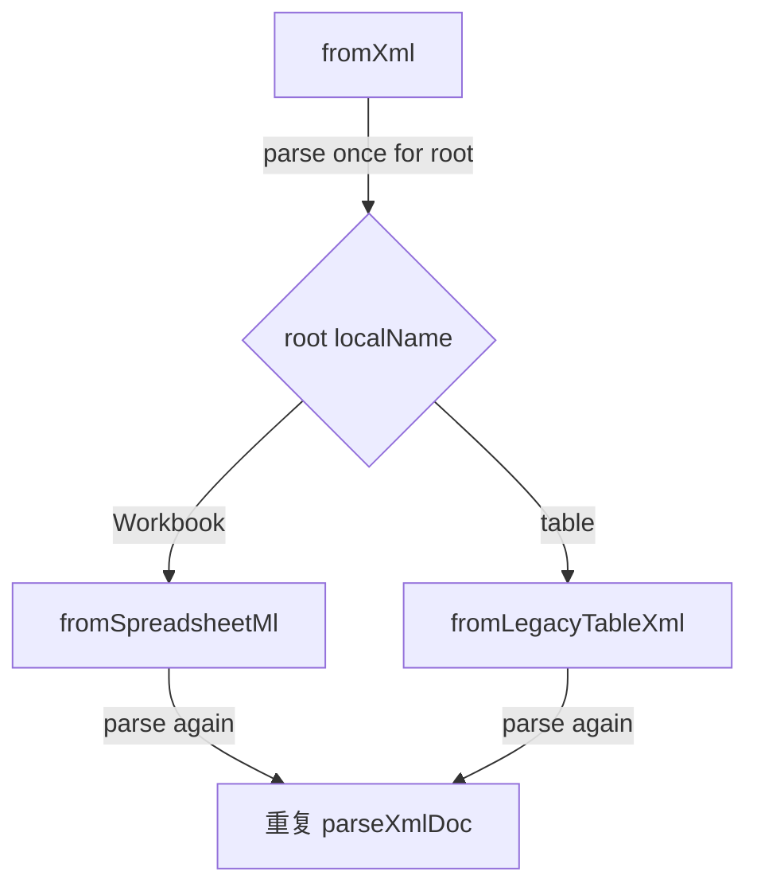

# 代码审查报告_2026_07_17：SpreadsheetML 表 XML 提交审查

## 总体评价

**方向正确，主路径（本工具导出 → 再导回）可用。** API 拆分清晰：`toSpreadsheetMl` / `fromSpreadsheetMl` 为默认，`toLegacyTableXml` / `fromLegacyTableXml` 兼容，`format/to=table-xml` 显式旧方言；CLI/MCP 文案与测试同步到位。

**不阻塞合并的问题**在于：读入对「Excel 另存后的真实 SpreadsheetML」偏脆；`fromXml` 双重解析；元数据编码不够稳健；本 commit 的测试依赖后续样例 commit。

---

## 问题与建议（按优先级）

### P0 — 建议尽快修

**1. `fromXml` 双重完整解析**（[`src/table_xml.hpp`](src/table_xml.hpp)）

当前先 `parseXmlDoc` 判根，再调用 `fromSpreadsheetMl`/`fromLegacyTableXml` 又解析一遍全文。大表会多一倍 CPU/分配。

建议：抽 `fromXmlNode(const XmlNode&, warnings*)`，或让 `fromSpreadsheetMl`/`fromLegacyTableXml` 接受已解析的 `XmlNode`（string 重载内部 parse 一次后转发）。`fromXml` 只 parse 一次。

**2. 未处理 `ss:Index` / 稀疏单元格**

读入按「子节点出现顺序」填列，忽略 Excel 常用的 `ss:Index`（跳过空单元格时列号会跳）。**Excel 打开 → 编辑 → 另存 XML → 再 import** 时，列可能错位或丢空列。

建议：读 Cell 时解析 `Index`（1-based），按目标列下标填值；缺位补 `""`。写出可继续密铺（本工具子集够用）。

**3. 本 commit 测试不自包含**

`testTableXml` 要求 `enemy_sample.xml` 含 `Workbook`，并读取 `enemy_sample.table-xml.xml`，但样例迁移在后续 `9179443`。单独 cherry-pick / bisect `fdb2bb1` 会红。

建议：样例与依赖它的断言放同一 commit，或测试内嵌最小 SpreadsheetML/legacy 字符串，样例文件仅作补充对齐。

---

### P1 — 稳健性

**4. Keywords 元数据编码脆弱**

写出：`graphmcp-id=` + 原始 `t.id`，用 `;` 分隔。若 `id` 含 `;` 或 `=`，读回会截断/错解析。

建议：对 id 做简单百分号编码，或改用独立自定义元素（如 `<CustomDocumentProperties>` / 固定属性字段），并加含特殊字符的往返测试。

**5. `(void)warnings` 误导**

[`fromSpreadsheetMl`](src/table_xml.hpp) 开头 `(void)warnings;`，随后 `appendColumnUnique(..., warnings)` 又使用它——死代码且暗示「未用」。删掉 `(void)warnings`。

**6. 工作表名按字节截断 31**

`sanitizeSheetName` 用 `s.resize(31)`，中文 UTF-8 可能截断到半个码点，Excel 偶发拒收。

建议：按 UTF-8 码点（或至少不在续字节处切开）截到 ≤31 字符。

**7. `hasHintRow=false` 不写出**

仅在 `true` 时写 Keywords。当前默认 false 可接受；若以后 Keywords 被 Excel 污染，无法区分「未设置」与「显式 false」。可选写出 `graphmcp-hasHintRow=false`，或读入时仅认本工具前缀键。

---

### P2 — 体验与边界

**8. 空表 / 仅表头**

0 列时仍写空 `<Row/>`，读回报 `header row empty`——合理。可考虑 0 列时拒绝写出并给出明确错误，与 CSV 路径一致。

**9. 只取第一个 `Worksheet` / `Table`**

多表簿只读第一张，符合「首版子集」；建议在 docs/错误信息中写明，避免用户以为丢了其它 sheet。

**10. CLI 提示仅针对 `to=xml`**

[`main.cpp`](src/main.cpp) 在 xml 导出时 stderr note 合理；`table-xml` 可加一句「非 Excel 格式」以免误用（低优先级）。

**11. 测试可再补**

- `ss:Index` 稀疏行往返（哪怕先 xfail）
- `id` 含 `;` 的 Keywords
- 空列名 → `col_N`
- 表头重复列 + warnings（SpreadsheetML 路径）

---

## 做得好的地方

- 零新依赖、手写 SpreadsheetML 子集，符合项目约束。
- 默认/兼容/显式旧格式三层语义清楚；嵌套列冲突仅旧方言拒绝，SpreadsheetML 用扁平表头——行为合理。
- 元数据走 `DocumentProperties`/`Keywords`，不污染单元格网格。
- MCP `toolList` 与导出 note 同步，避免「不是 SpreadsheetML」旧文案残留。

---

## 建议落地顺序（若开 follow-up）

1. 消除双重 parse + 删 `(void)warnings`
2. `ss:Index` 读入对齐
3. Keywords/id 转义 + 补测试；理顺 commit/样例依赖
4. UTF-8 安全截断 sheet 名

无需为审查本身改计划文件；上述为代码建议，确认后再实现。
